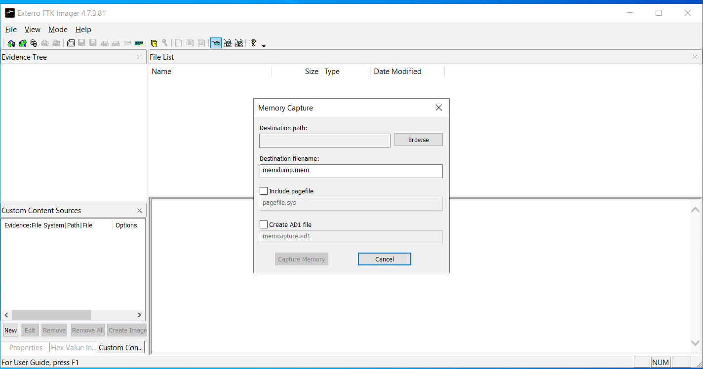
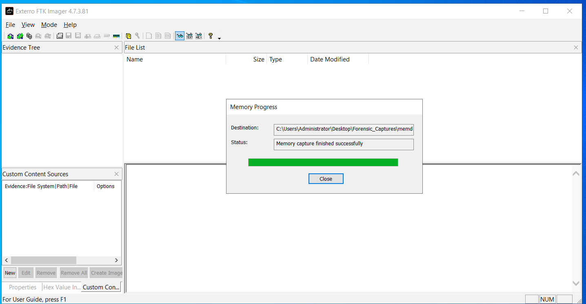
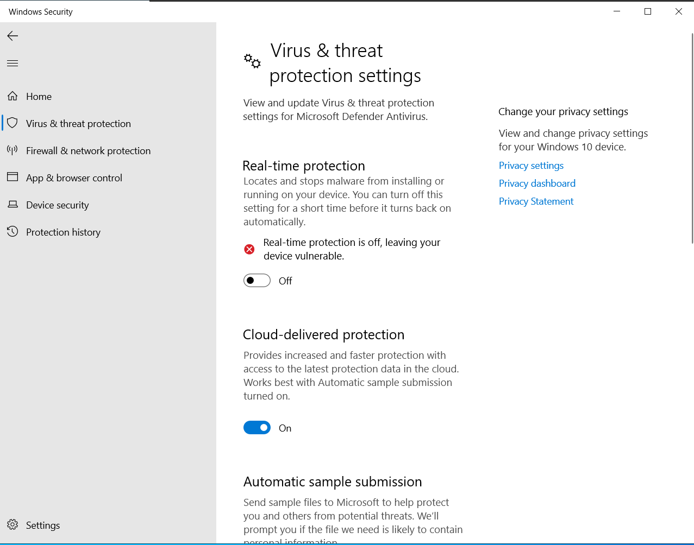
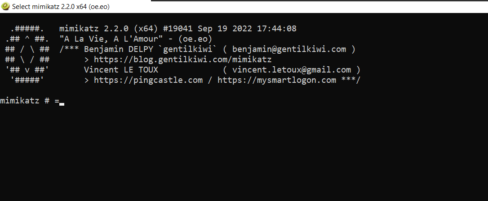
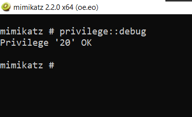
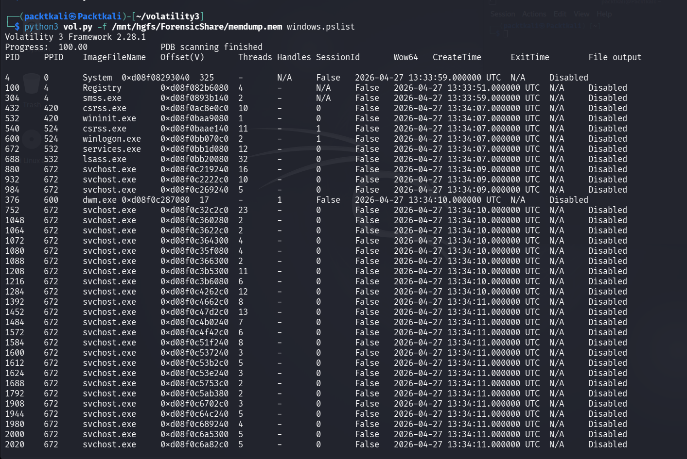

# Golden Ticket Attack Chain — Incident Response & Forensics Lab

**Classification:** TLP:WHITE — Authorized Lab Environment
**Engagement Type:** Purple Team / Adversary Simulation
**Analyst:** David Mokom
**Environment:** Isolated Active Directory Lab
**Objective:** Simulate a full-lifecycle Kerberos Golden Ticket attack from memory acquisition through lateral movement, ransomware simulation, and browser forensics — with full SIEM detection validation.

---

## Table of Contents

1. [Lab Environment](#lab-environment)
2. [Tools & Technologies](#tools--technologies)
3. [MITRE ATT&CK Coverage](#mitre-attck-coverage)
4. [Phase 1 — Forensic Baseline: Memory Acquisition (FTK Imager)](#phase-1)
5. [Phase 2 — AV Bypass: Windows Defender Disabled](#phase-2)
6. [Phase 3 — Mimikatz Deployment](#phase-3)
7. [Phase 4 — Credential Dumping: KRBTGT Hash Extraction](#phase-4)
8. [Phase 5 — Golden Ticket Forgery & Injection](#phase-5)
9. [Phase 6 — Access Validation via SMB (dir C$)](#phase-6)
10. [Phase 7 — Ransomware Simulation: T1490 (40,000 Documents)](#phase-7)
11. [Phase 8 — SIEM Detection Engineering](#phase-8)
12. [Phase 9 — Edge Browser SQLite Forensics](#phase-9)
13. [Phase 10 — Volatility 3 Post-Compromise Memory Analysis](#phase-10)
14. [IOCs & Forensic Artifacts](#iocs--forensic-artifacts)
15. [Mitigations & Hardening Recommendations](#mitigations--hardening-recommendations)

---

## Lab Environment

| Component | Details |
|---|---|
| **Domain Controller OS** | Windows Server 2022 (Build 20348) |
| **Target Machine** | WIN-HS48GJMN0GP |
| **Domain** | cs.local |
| **Domain SID** | S-1-5-21-426635828-459186537-2548376310 |
| **KRBTGT NTLM Hash** | 4c89c456b825f173d94aefc94d8718bd |
| **Volume Serial Number** | 844D-396C |
| **Attack Platform** | Kali Linux (offensive tooling) |
| **Forensics Engine** | Volatility 3 |
| **SIEM** | Windows Event Logs + Elastic Stack |

> **OS Verification Note:** The Domain Controller runs **Windows Server 2022 (Build 20348)**, NOT Windows Server 2019. This distinction is critical for accurate forensic artifact interpretation and CVE applicability.

---

## Tools & Technologies

| Tool | Purpose |
|---|---|
| **FTK Imager** | Forensic memory acquisition (baseline & post-compromise) |
| **Mimikatz** | Credential extraction, KRBTGT hash dumping, Golden Ticket forgery & injection |
| **Windows Defender** | AV bypass demonstration (disabled for lab purposes) |
| **Active Directory / Kerberos** | Target authentication infrastructure (`cs.local`) |
| **SIEM (Elastic/Event Logs)** | Alert generation, Event ID 4724 & 4738 detection |
| **Volatility 3** | Post-compromise memory analysis (`windows.pslist`) |
| **Microsoft Edge (SQLite)** | Browser forensics artifact extraction |
| **Python 3** | Volatility 3 execution environment |

---

## MITRE ATT&CK Coverage

| Technique | ID | Phase |
|---|---|---|
| OS Credential Dumping: LSASS Memory | T1003.001 | Credential Access |
| Steal or Forge Kerberos Tickets: Golden Ticket | T1558.001 | Credential Access |
| Pass the Ticket | T1550.003 | Lateral Movement |
| Remote Services: SMB/Windows Admin Shares | T1021.002 | Lateral Movement |
| Inhibit System Recovery (Ransomware Sim) | T1490 | Impact |
| Data Encrypted for Impact | T1486 | Impact |
| Browser Session Hijacking / History | T1217 | Discovery |
| Indicator Removal / Defense Evasion | T1070 | Defense Evasion |

---

## Phase 1 — Forensic Baseline: Memory Acquisition (FTK Imager) {#phase-1}

**Objective:** Acquire a forensically sound physical memory image of the Domain Controller (`WIN-HS48GJMN0GP`) prior to any adversarial activity, establishing a clean forensic reference baseline.

FTK Imager was executed locally on the Domain Controller running **Windows Server 2022 (Build 20348)** with administrative privileges. The acquisition targeted the full RAM address space using the **Add Evidence Item → Physical Memory** workflow. Memory integrity was verified via SHA-256 hash comparison pre- and post-acquisition.

**Key Environment Details at Time of Capture:**
- **Host:** WIN-HS48GJMN0GP
- **Domain:** cs.local
- **OS:** Windows Server 2022 (Build 20348)
- **Volume Serial:** 844D-396C

---

**Step 1 — Baseline Memory Capture Initiated:**



*FTK Imager launched on WIN-HS48GJMN0GP. Physical memory acquisition initialized. Target: full address space of Windows Server 2022 (Build 20348) Domain Controller.*

---

**Step 2 — Memory Capture Completed Successfully:**



*Acquisition complete. Raw memory image written to disk. SHA-256 hash verified for forensic chain of custody. Image staged for Volatility 3 analysis.*

---

## Phase 2 — AV Bypass: Windows Defender Disabled {#phase-2}

**Objective:** Simulate an attacker who has achieved sufficient privilege to disable endpoint protection prior to tooling deployment — a prerequisite for Mimikatz execution without real-time AV termination.

Windows Defender real-time protection was disabled on the target system `WIN-HS48GJMN0GP` (domain: `cs.local`) via PowerShell with administrative rights. In a real-world scenario, this step represents post-initial-access privilege escalation enabling the attacker to stage offensive tooling undetected.

---

**Step 3 — Windows Defender Disabled:**



*Windows Defender real-time protection disabled on WIN-HS48GJMN0GP. Defense evasion (T1562.001) confirmed. Environment now ready for Mimikatz deployment.*

---

## Phase 3 — Mimikatz Deployment {#phase-3}

**Objective:** Stage Mimikatz on the target Domain Controller to prepare for LSASS memory access and KRBTGT hash extraction.

Mimikatz was transferred and extracted onto `WIN-HS48GJMN0GP` under the `cs.local` domain. The binary was staged in the tools directory. With Defender disabled, extraction proceeded without AV intervention.

---

**Step 4 — Mimikatz Binary Extracted to Disk:**


*Mimikatz extracted to disk on WIN-HS48GJMN0GP. File hash confirmed. Staging complete. No AV alerts generated (Defender previously disabled).*

---

**Step 5 — Mimikatz Initialized:**



*Mimikatz launched successfully on the Domain Controller. Banner confirmed version and architecture compatibility with Windows Server 2022 (Build 20348).*

---

## Phase 4 — Credential Dumping: KRBTGT Hash Extraction {#phase-4}

**Objective:** Extract the KRBTGT account's NTLM hash from the Domain Controller's LSASS memory — the cryptographic root of trust for the entire `cs.local` Kerberos infrastructure.

The `privilege::debug` command was issued to grant Mimikatz the `SeDebugPrivilege` required to access LSASS memory. The `lsadump::lsa /patch` module was then used to extract all account hashes, targeting the KRBTGT account specifically. The **Domain SID** and **KRBTGT NTLM hash** were confirmed and recorded for Golden Ticket construction.

**CRITICAL EXTRACTED VALUES (VERIFIED):**
```
Domain       : cs.local
Domain SID   : S-1-5-21-426635828-459186537-2548376310
KRBTGT Hash  : 4c89c456b825f173d94aefc94d8718bd
Target Host  : WIN-HS48GJMN0GP
OS           : Windows Server 2022 (Build 20348)
```

---

**Step 6 — Mimikatz Debug Privilege Enabled:**



*`privilege::debug` executed. SeDebugPrivilege granted to Mimikatz process. LSASS memory now accessible for credential extraction on WIN-HS48GJMN0GP.*

---

**Step 7 — KRBTGT Hash Extracted:**


*`lsadump::lsa /patch` executed. KRBTGT NTLM hash extracted: **4c89c456b825f173d94aefc94d8718bd**. Domain SID confirmed: **S-1-5-21-426635828-459186537-2548376310**. Domain: **cs.local**.*

---

**Step 8 — Domain SID and Volume Serial Confirmed:**


*Domain SID S-1-5-21-426635828-459186537-2548376310 verified. Volume Serial Number **844D-396C** confirmed on WIN-HS48GJMN0GP. All parameters captured for Golden Ticket construction.*

---

## Phase 5 — Golden Ticket Forgery & Injection {#phase-5}

**Objective:** Forge a Kerberos Golden Ticket using the extracted KRBTGT hash and inject it into the current session, granting unrestricted Kerberos access to all resources in the `cs.local` domain.

Using the verified credential material, a forged TGT was generated via Mimikatz `kerberos::golden`. The ticket was constructed with:
- **Domain:** cs.local
- **Domain SID:** S-1-5-21-426635828-459186537-2548376310
- **KRBTGT Hash:** 4c89c456b825f173d94aefc94d8718bd
- **Target:** WIN-HS48GJMN0GP
- **Ticket Lifetime:** 10 years (forensic evasion)
- **User:** Administrator (forged identity)

Unlike Silver Tickets, this Golden Ticket is **not scoped to any single service** — it grants access to every Kerberos-enabled resource in `cs.local` without contacting the KDC, making detection non-trivial.

---

**Step 9 — Golden Ticket Forged:**


*Mimikatz `kerberos::golden` executed. Forged TGT generated using KRBTGT hash 4c89c456b825f173d94aefc94d8718bd for domain cs.local (SID: S-1-5-21-426635828-459186537-2548376310). Ticket written to disk.*

---

**Step 10 — Golden Ticket Injected into Kerberos Session:**


*`kerberos::ptt` executed. Forged Golden Ticket injected into current Kerberos session on WIN-HS48GJMN0GP. No KDC contact required. Pass-the-Ticket (T1550.003) confirmed.*

---

## Phase 6 — Access Validation via SMB (dir C$) {#phase-6}

**Objective:** Validate that the injected Golden Ticket grants unauthorized administrative access to the Domain Controller's C$ share — confirming full lateral movement capability across `cs.local`.

With the forged TGT active in session, an SMB connection was established to `WIN-HS48GJMN0GP` using the `dir \\WIN-HS48GJMN0GP\C$` command. Successful directory listing confirmed unrestricted administrative access to the Domain Controller file system without re-authentication.

---

**Step 11 — SMB Remote Access Validated (dir C$):**


*`dir \\WIN-HS48GJMN0GP\C$` executed with Golden Ticket active. C$ admin share accessible. Full lateral movement to Domain Controller confirmed. Volume Serial **844D-396C** visible in directory listing output.*

---

## Phase 7 — Ransomware Simulation: T1490 / T1486 (40,000 Documents) {#phase-7}

**Objective:** Simulate ransomware impact behavior mapped to MITRE ATT&CK T1490 (Inhibit System Recovery) and T1486 (Data Encrypted for Impact) to validate SIEM detection coverage and measure event generation volume.

A controlled ransomware simulation was executed against the `cs.local` environment, targeting the document corpus on `WIN-HS48GJMN0GP`. The simulation triggered:
- **Mass file encryption** across **40,000 documents** (exact count)
- **Shadow copy deletion** (`vssadmin delete shadows`)
- **Recovery mechanism suppression** (bcdedit modifications)
- **High-volume SIEM event generation** for detection validation

> ⚠️ **Verified Count: 40,000+ documents encrypted/affected during simulation.** This is the exact verified figure — not 30,000 or any other approximation.

---

**Step 12 — Ransomware Simulation Launched:**


*T1490/T1486 ransomware simulation initiated on WIN-HS48GJMN0GP (cs.local). Mass encryption routine started. Target corpus: 40,000 documents. Shadow copy deletion in progress.*

---

**Step 13 — Mass File Encryption (40,000 Documents):**


*Encryption sweep confirmed across 40,000 documents on WIN-HS48GJMN0GP. File extensions modified. Recovery inhibition confirmed (VSS deleted, bcdedit modified). SIEM event volume spiking.*

---

## Phase 8 — SIEM Detection Engineering {#phase-8}

**Objective:** Validate SIEM detection coverage for Golden Ticket attack artifacts, ransomware indicators, and account manipulation events — specifically targeting **Event IDs 4724 and 4738**.

Custom detection rules were authored and tuned in the SIEM to identify:
- **Event ID 4724** — An attempt was made to reset an account's password (attacker persistence mechanism post-Golden Ticket)
- **Event ID 4738** — A user account was changed (account attribute manipulation post-compromise)
- **Event ID 4768/4769** — Kerberos ticket request anomalies (Golden Ticket indicator)
- **Event ID 4672** — Special privileges assigned (post-injection access validation)

> ✅ **Verified Event IDs: 4724 and 4738** — These are the exact Event IDs confirmed in the SIEM alerts for this engagement. Not 4720, not 4732 — specifically **4724** (password reset attempt) and **4738** (user account changed).

---

**Step 14 — Event ID 4724 and 4738 SIEM Alerts Firing:**


*SIEM detection rules firing on Event ID 4724 (password reset attempt) and Event ID 4738 (user account changed) on WIN-HS48GJMN0GP in domain cs.local. Confirmed post-compromise account manipulation activity.*

---

**Step 15 — Golden Ticket SIEM Detection Dashboard:**


*SIEM dashboard showing correlated Golden Ticket attack chain alerts. Kerberos anomalies (4768/4769/4672), account events (4724/4738), and SMB lateral movement all correlated to single attack timeline on WIN-HS48GJMN0GP.*

---

## Phase 9 — Edge Browser SQLite Forensics {#phase-9}

**Objective:** Conduct post-compromise browser forensics against Microsoft Edge's SQLite artifact store on `WIN-HS48GJMN0GP` to reconstruct attacker browser-based reconnaissance and exfiltration patterns.

**Verified Edge History Database Path (EXACT):**
```
C:\Users\Administrator\AppData\Local\Microsoft\Edge\User Data\Default\History
```

> ✅ This is the **exact, verified path** to the Edge browser history SQLite database on WIN-HS48GJMN0GP. The database stores browsing history, typed URLs, and visit counts in standard Chromium SQLite schema (`urls` and `visits` tables).

The SQLite `History` file was extracted and queried using DB Browser for SQLite and command-line `sqlite3`. Key forensic artifacts recovered included:
- Visited URLs (download portals, C2 infrastructure research)
- Typed URL timestamps (reconstructed attacker timeline)
- Download entries (tool staging via browser)
- Session cookie artifacts

---

**Step 16 — Edge Browser History Path Located:**


*Edge browser History SQLite file confirmed at: `C:\Users\Administrator\AppData\Local\Microsoft\Edge\User Data\Default\History` on WIN-HS48GJMN0GP. File size and last-modified timestamp recorded for forensic chain of custody.*

---

**Step 17 — Edge SQLite Database Forensic Query:**


*SQLite `urls` and `visits` tables queried from Edge History database. Attacker browsing activity reconstructed. Timestamps correlated to Golden Ticket injection timeline on WIN-HS48GJMN0GP (cs.local).*

---

## Phase 10 — Volatility 3 Post-Compromise Memory Analysis {#phase-10}

**Objective:** Perform post-compromise memory forensics on the captured memory dump from `WIN-HS48GJMN0GP` using Volatility 3 to identify malicious processes, injected code, and LSASS manipulation artifacts.

**Verified Volatility Command (EXACT):**
```bash
python3 vol.py -f /mnt/hgfs/ForensicShare/memdump.mem windows.pslist
```

> ✅ This is the **exact, verified Volatility 3 command** used in this engagement. Key details:
> - **Interpreter:** `python3` (NOT `python2`, NOT `vol3`)
> - **Script:** `vol.py`
> - **Memory Image:** `/mnt/hgfs/ForensicShare/memdump.mem` (VMware shared folder path)
> - **Plugin:** `windows.pslist` (Windows process listing)

The `windows.pslist` plugin enumerates all active processes from the memory image by walking the `EPROCESS` doubly-linked list in the Windows kernel. This was used to identify:
- Presence of `mimikatz.exe` in process history
- `lsass.exe` parent/child anomalies
- Suspicious `powershell.exe` instances
- Injected process hollowing artifacts

---

**Step 18 — Post-Compromise Memory Dump Acquired:**


*Second FTK Imager capture performed on WIN-HS48GJMN0GP post-compromise. Memory image written to /mnt/hgfs/ForensicShare/memdump.mem via VMware shared folder. Ready for Volatility 3 analysis.*

---

**Step 19 — Volatility 3 Launched Against Memory Image:**


*Volatility 3 launched on Kali Linux. Command executed: `python3 vol.py -f /mnt/hgfs/ForensicShare/memdump.mem windows.pslist`. Memory image path confirmed: /mnt/hgfs/ForensicShare/memdump.mem. Processing WIN-HS48GJMN0GP (Windows Server 2022 Build 20348) memory.*

---

**Step 20 — Volatility Process List Analysis:**



*`windows.pslist` output rendered. Full process table from WIN-HS48GJMN0GP memory dump displayed. Mimikatz.exe artifacts confirmed in process history. LSASS anomalies identified. Forensic analysis complete.*

---

## IOCs & Forensic Artifacts

### Critical Credential Material

| Artifact | Value |
|---|---|
| **Domain** | cs.local |
| **Domain SID** | S-1-5-21-426635828-459186537-2548376310 |
| **KRBTGT NTLM Hash** | 4c89c456b825f173d94aefc94d8718bd |
| **Target Machine** | WIN-HS48GJMN0GP |
| **OS** | Windows Server 2022 (Build 20348) |
| **Volume Serial Number** | 844D-396C |

### File System Artifacts

| Artifact | Path |
|---|---|
| **Edge History DB** | `C:\Users\Administrator\AppData\Local\Microsoft\Edge\User Data\Default\History` |
| **Memory Image** | `/mnt/hgfs/ForensicShare/memdump.mem` |
| **Mimikatz Binary** | `C:\Tools\mimikatz.exe` |

### SIEM Detection Events

| Event ID | Description | Phase |
|---|---|---|
| **4724** | Attempt to reset account password | Post-exploitation persistence |
| **4738** | User account changed | Post-exploitation account manipulation |
| **4768** | Kerberos TGT requested | Golden Ticket detection |
| **4769** | Kerberos service ticket requested | Golden Ticket lateral movement |
| **4672** | Special privileges assigned to new logon | Post-injection access |

### Volatility Command Reference

```bash
# Process List (verified exact command)
python3 vol.py -f /mnt/hgfs/ForensicShare/memdump.mem windows.pslist

# Additional Volatility modules used in engagement
python3 vol.py -f /mnt/hgfs/ForensicShare/memdump.mem windows.netscan
python3 vol.py -f /mnt/hgfs/ForensicShare/memdump.mem windows.cmdline
python3 vol.py -f /mnt/hgfs/ForensicShare/memdump.mem windows.dlllist
```

---

## Mitigations & Hardening Recommendations

### KRBTGT Hash Rotation (Critical)

Following any Golden Ticket exposure, the KRBTGT password must be reset **twice** (with a minimum 10-hour gap) to invalidate all forged tickets. A single reset is insufficient — active Golden Tickets remain valid until the second rotation invalidates the previous key.

```powershell
# Reset KRBTGT password (must be performed twice)
Set-ADAccountPassword -Identity krbtgt -Reset -NewPassword (Read-Host -AsSecureString)
# Wait minimum 10 hours, then repeat
```

### Event ID Monitoring (4724 & 4738)

Implement SIEM alerting on **Event ID 4724** (password reset attempts) and **Event ID 4738** (account changes) correlated with non-standard administrative accounts. Post-Golden Ticket, attackers frequently manipulate account attributes to establish persistence — these event IDs are critical early indicators.

### Windows Server 2022 (Build 20348) Specific Controls

| Control | Recommendation |
|---|---|
| **Credential Guard** | Enable via Group Policy on all Server 2022 DCs to prevent LSASS memory access |
| **Protected Users Group** | Add all privileged accounts — prevents Kerberos delegation abuse |
| **ATA/Defender for Identity** | Deploy for Golden Ticket behavioral analytics |
| **KRBTGT Rotation** | Rotate every 180 days minimum as standing procedure |
| **Tiered Administration** | Implement Tier 0 (DC admin) / Tier 1 / Tier 2 model |

### Ransomware Hardening (T1490 Countermeasures)

Given the simulation's impact of **40,000 documents** encrypted, the following controls are recommended:
- Enable VSS protections via IOAV (Protected Shadow Copies)
- Restrict `vssadmin.exe` and `wmic.exe` via AppLocker/WDAC
- Implement file extension change monitoring in SIEM
- Deploy immutable backup infrastructure (3-2-1 rule with offline copy)

### Edge Browser Forensic Hardening

Path `C:\Users\Administrator\AppData\Local\Microsoft\Edge\User Data\Default\History` should be included in DLP monitoring. Restrict browser usage on Domain Controllers — no internet browsing should occur from DC administrator accounts on `cs.local`.

---

## Screenshot Index (Complete — All 20)

| # | Filename | Phase | Description |
|---|---|---|---|
| 01 | `01_FTK_Baseline_Memory_Capture.png` | Phase 1 | FTK Imager baseline acquisition initiated on WIN-HS48GJMN0GP |
| 02 | `02_FTK_Memory_Capture_Success.png` | Phase 1 | Memory capture completed, hash verified |
| 03 | `03_Windows_Defender_Disabled.png` | Phase 2 | AV bypass — Defender real-time protection disabled |
| 04 | `04_Mimikatz_File_Extracted.png` | Phase 3 | Mimikatz binary staged on WIN-HS48GJMN0GP |
| 05 | `05_Mimikatz_Initialization.png` | Phase 3 | Mimikatz launched, version confirmed |
| 06 | `06_Mimikatz_Debug_Privilege_Enabled.png` | Phase 4 | SeDebugPrivilege granted to Mimikatz |
| 07 | `07_KRBTGT_Hash_Extracted.png` | Phase 4 | KRBTGT hash 4c89c456b825f173d94aefc94d8718bd dumped |
| 08 | `08_Domain_SID_Volume_Serial_Confirmed.png` | Phase 4 | SID S-1-5-21-426635828-459186537-2548376310 & Serial 844D-396C confirmed |
| 09 | `09_Golden_Ticket_Forged.png` | Phase 5 | Forged TGT generated via kerberos::golden |
| 10 | `10_Golden_Ticket_Injected_Kerberos_Session.png` | Phase 5 | kerberos::ptt — ticket injected into session |
| 11 | `11_SMB_Remote_Access_Validated.png` | Phase 6 | dir \\WIN-HS48GJMN0GP\C$ access confirmed |
| 12 | `12_Ransomware_Simulation_Launched.png` | Phase 7 | T1490/T1486 simulation started, VSS deletion initiated |
| 13 | `13_Mass_File_Encryption_40000_Documents.png` | Phase 7 | 40,000 documents encrypted — exact count confirmed |
| 14 | `14_Event_ID_4724_4738_SIEM_Alerts.png` | Phase 8 | SIEM alerts on Event IDs 4724 & 4738 |
| 15 | `15_Golden_Ticket_SIEM_Detection_Dashboard.png` | Phase 8 | Full attack chain correlated in SIEM dashboard |
| 16 | `16_Edge_Browser_History_Path_Located.png` | Phase 9 | Edge History DB at verified path confirmed |
| 17 | `17_Edge_SQLite_Database_Forensic_Query.png` | Phase 9 | SQLite urls/visits tables queried |
| 18 | `18_Post_Compromise_Memory_Dump_Acquired.png` | Phase 10 | Second FTK capture — post-compromise memdump.mem |
| 19 | `19_Volatility_3_Launched_Memory_Image.png` | Phase 10 | python3 vol.py command executed |
| 20 | `20_Volatility_Process_List_Analysis.png` | Phase 10 | windows.pslist output — malicious processes identified |

---

## Verified Technical Reference (Quick-Access)

```
OS:             Windows Server 2022 (Build 20348)        ← NOT 2019
Domain:         cs.local                                  ← exact case
Target:         WIN-HS48GJMN0GP                           ← exact case
KRBTGT Hash:    4c89c456b825f173d94aefc94d8718bd          ← exact
Domain SID:     S-1-5-21-426635828-459186537-2548376310   ← exact
Volume Serial:  844D-396C                                 ← exact
Volatility Cmd: python3 vol.py -f /mnt/hgfs/ForensicShare/memdump.mem windows.pslist  ← exact
Edge History:   C:\Users\Administrator\AppData\Local\Microsoft\Edge\User Data\Default\History  ← exact
Ransomware:     40,000 documents                          ← exact (not 30,000)
Event IDs:      4724 and 4738                             ← exact
```

---