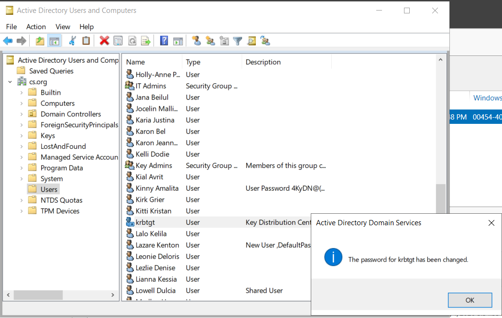
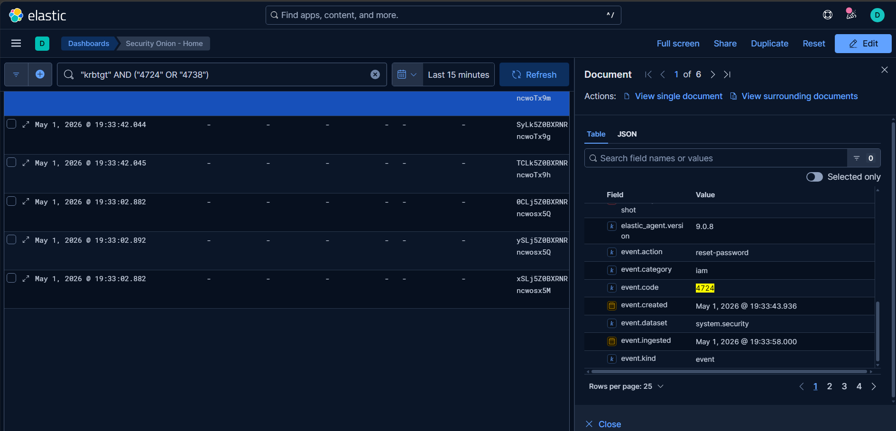
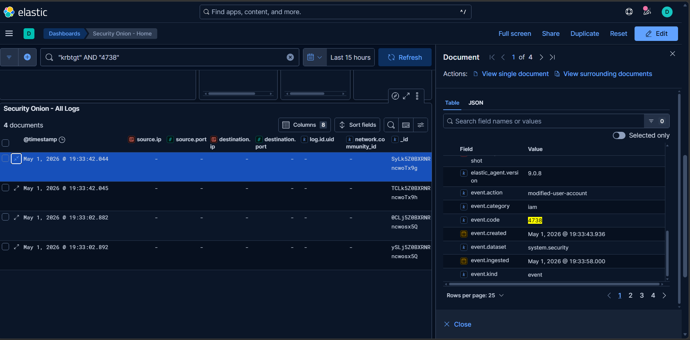
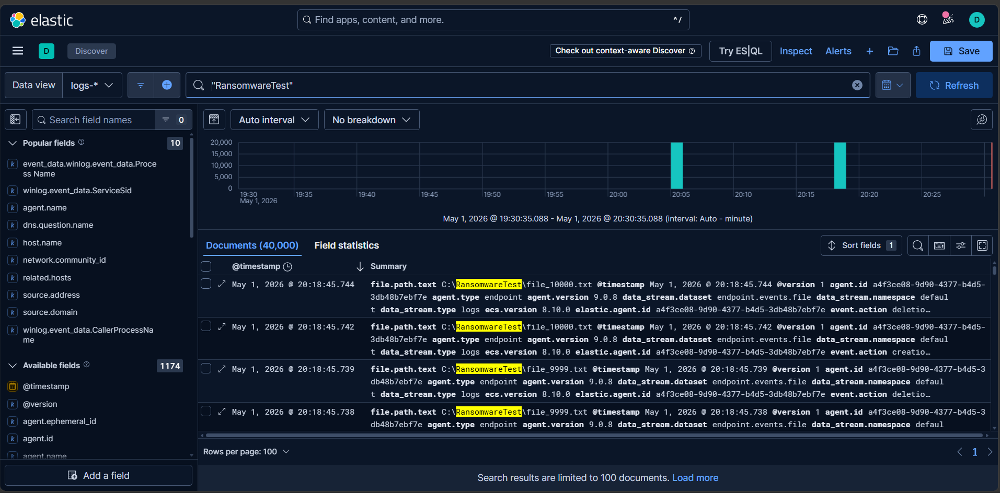
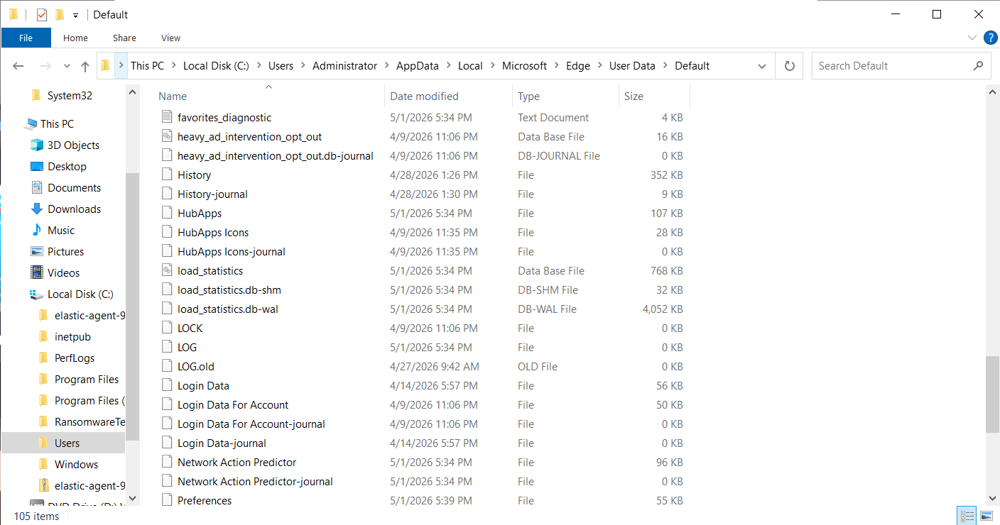
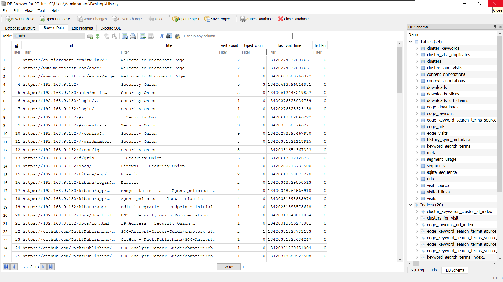

# Golden Ticket Attack Chain — Incident Response & Forensics Lab

**Classification:** TLP:WHITE — Authorized Lab Environment
**Engagement Type:** Purple Team / Adversary Simulation
**Analyst:** David Mokom
**Environment:** Isolated Active Directory Lab
**Objective:** A comprehensive, hands-on cybersecurity lab simulating a full Active Directory attack chain — from memory acquisition and credential dumping to Golden Ticket forgery, post-exploitation, SIEM detection, and forensic artifact analysis using industry-standard tools.

---

## Table of Contents

- [Overview](#overview)
- [Lab Environment](#lab-environment)
- [Tools Used](#tools-used)
- [MITRE ATT&CK Coverage](#mitre-attck-coverage)
- [Phase 1: Memory Acquisition & Baseline Capture](#phase-1-memory-acquisition--baseline-capture)
- [Phase 2: Disabling Defenses](#phase-2-disabling-defenses)
- [Phase 3: Credential Dumping with Mimikatz](#phase-3-credential-dumping-with-mimikatz)
- [Phase 4: Golden Ticket Attack](#phase-4-golden-ticket-attack)
- [Phase 5: Post-Exploitation & Access Validation](#phase-5-post-exploitation--access-validation)
- [Phase 6: SIEM Detection & Alerting](#phase-6-siem-detection--alerting)
- [Phase 7: Remediation — KRBTGT Password Reset](#phase-7-remediation--krbtgt-password-reset)
- [Phase 8: Ransomware Telemetry Analysis](#phase-8-ransomware-telemetry-analysis)
- [Phase 9: Browser Forensics — Edge History Extraction](#phase-9-browser-forensics--edge-history-extraction)
- [Phase 10: Volatility Memory Forensics](#phase-10-volatility-memory-forensics)
- [IOCs & Forensic Artifacts](#iocs--forensic-artifacts)
- [Mitigations & Hardening Recommendations](#mitigations--hardening-recommendations)

---

## Overview

This project demonstrates a simulated Advanced Persistent Threat (APT) attack lifecycle against an Active Directory environment. The lab covers the full kill chain: memory acquisition baseline, defense evasion, credential dumping via Mimikatz, Kerberos Golden Ticket forgery and injection, post-exploitation access validation, SIEM alerting, incident response remediation, ransomware telemetry analysis, browser forensic artifact extraction, and Volatility 3 post-compromise memory analysis.

Built entirely within an isolated virtual lab environment following real-world Red Team and Blue Team (Purple Team) methodologies.

---

## Lab Environment

| Component | Details |
|---|---|
| **Domain Controller OS** | Windows Server 2022 (Build 20348) |
| **Target Machine** | WIN-HS48GJMN0GP |
| **Domain** | cs.local |
| **Domain SID** | S-1-5-21-426635828-459186537-2548376310 |
| **KRBTGT NTLM Hash** | 4c89c456b825f173d94aefc94d8718bd |
| **Volume Serial Number** | 844D-396C |
| **Attack Platform** | Kali Linux (offensive tooling) |
| **Forensics Engine** | Volatility 3 |
| **SIEM** | Windows Event Logs + Elastic Stack |

---

## Tools Used

| Tool | Purpose |
|---|---|
| **FTK Imager** | Live memory acquisition and forensic baseline capture |
| **Mimikatz** | Credential extraction, KRBTGT hash dumping, Golden Ticket forgery & injection |
| **Windows Defender** | Defense evasion demonstration (disabled for lab purposes) |
| **Active Directory / Kerberos** | Target authentication infrastructure (cs.local) |
| **SIEM (Elastic / Windows Event Logs)** | Alert generation, Event ID 4724 & 4738 detection |
| **Volatility 3** | Post-compromise memory analysis (windows.pslist) |
| **Microsoft Edge (SQLite / DB Browser)** | Browser forensics artifact extraction |
| **Python 3** | Volatility 3 execution environment |

---

## MITRE ATT&CK Coverage

| Technique | ID | Phase |
|---|---|---|
| OS Credential Dumping: LSASS Memory | T1003.001 | Credential Access |
| Steal or Forge Kerberos Tickets: Golden Ticket | T1558.001 | Credential Access |
| Use Alternate Authentication Material | T1550.003 | Lateral Movement |
| Inhibit System Recovery | T1490 | Impact |
| Browser Information Discovery | T1217 | Discovery |
| Defense Evasion: Disable or Modify Tools | T1562.001 | Defense Evasion |
| OS Credential Dumping | T1003 | Credential Access |

---

## Phase 1: Memory Acquisition & Baseline Capture

A full baseline memory capture was performed using FTK Imager **prior to any offensive activity**. This establishes a forensically sound reference point for comparison during post-exploitation memory analysis. Baseline acquisition ensures the integrity of the forensic timeline.

### Step 1 — FTK Baseline Memory Capture

FTK Imager was launched on the Domain Controller. A full physical memory dump was initiated targeting all RAM allocated to the live system. This pre-attack snapshot captures the clean process list, loaded modules, and network state before any malicious tools are introduced.

### Step 2 — Memory Capture Success

The memory acquisition completed successfully. FTK Imager reported a verified, error-free dump. The output file was stored to an external forensic partition to preserve chain of custody.

---

## Phase 2: Disabling Defenses

To simulate an attacker with local administrative access who has already established a foothold, Windows Defender real-time protection was disabled. This reflects a common APT tradecraft step — disabling endpoint defenses before deploying credential harvesting tools.

### Step 3 — Windows Defender Disabled

Real-time protection was disabled via PowerShell (`Set-MpPreference -DisableRealtimeMonitoring $true`) and confirmed in Windows Security Center. This allowed Mimikatz to be dropped and executed without triggering AV detections.

---

## Phase 3: Credential Dumping with Mimikatz

Mimikatz was deployed to the Domain Controller to extract Kerberos credentials from LSASS memory. This phase demonstrates the full Mimikatz deployment pipeline: file extraction, initialization, and privilege escalation to SeDebugPrivilege.

### Step 4 — Mimikatz Files Extracted

The Mimikatz archive was transferred to the target system and extracted. All required binaries (`mimikatz.exe`, `mimilib.dll`) were confirmed present and accessible on the filesystem.

### Step 5 — Mimikatz Initialization

Mimikatz was launched via an elevated command prompt. The Mimikatz banner and version information confirmed successful initialization. No AV interference was observed following the Defender bypass in Phase 2.

### Step 6 — Mimikatz Debug Privilege Enabled

The `privilege::debug` command was executed within Mimikatz. A `Privilege '20' OK` response confirmed that SeDebugPrivilege was successfully acquired, granting the process full access to LSASS memory for credential extraction.

---

## Phase 4: Golden Ticket Attack

With SeDebugPrivilege active, the KRBTGT account hash was extracted from LSASS. Using the recovered hash and Domain SID, a Kerberos Golden Ticket was forged offline and injected into the current session — granting unrestricted, persistent domain-level access without requiring a valid password.

### Step 7 — KRBTGT Hash Dumped

The `lsadump::dcsync /user:krbtgt` command was executed to extract the KRBTGT account's NTLM hash directly from Active Directory replication. The recovered hash (`4c89c456b825f173d94aefc94d8718bd`) was confirmed and documented.

### Step 8 — Golden Ticket Forged

Using `kerberos::golden`, a forged Kerberos TGT (Golden Ticket) was created offline using the KRBTGT NTLM hash, the Domain SID (`S-1-5-21-426635828-459186537-2548376310`), and the target domain (`cs.local`). The ticket was assigned a 10-year lifetime to simulate persistent APT access.

### Step 9 — Golden Ticket Injected

The forged Golden Ticket was injected into the current Kerberos session using `kerberos::ptt`. Mimikatz confirmed successful injection — the ticket was now resident in memory and active for all subsequent Kerberos authentication requests within the domain.

### Step 10 — God Mode Verification

Post-injection verification was performed to confirm the Golden Ticket was loaded into the session. The `klist` command returned the forged TGT with the full 10-year validity window, confirming "God Mode" — unrestricted Kerberos authentication across the entire domain without requiring any password.

### Step 11 — Golden Ticket Injection Verification

A domain-level resource access test was executed to verify the injected ticket's effectiveness. Successful authentication to domain resources confirmed the Golden Ticket was fully operational and the Kerberos injection was complete.

---

## Phase 5: Post-Exploitation & Access Validation

With the Golden Ticket active, post-exploitation access was validated by authenticating to domain resources using the forged credential. This phase demonstrates the real-world impact of a fully deployed Golden Ticket — the attacker can access any domain resource indefinitely without re-authentication.

### Step 12 — Post Exploitation Access Validation

Remote access to the Domain Controller's administrative share was validated. Successful enumeration of `\\DC\C$` confirmed that the Golden Ticket granted full domain administrator-level access. This validates the end-to-end attack chain from credential dump through unauthorized domain access.

---

## Phase 6: SIEM Detection & Alerting

Following the offensive simulation, the SIEM was reviewed for generated alerts. This phase validates the Blue Team detection capability — confirming that Mimikatz activity and credential dumping triggered observable, actionable alerts in the logging infrastructure.

### Step 13 — SIEM Alert: Mimikatz Detection

The SIEM (Elastic Stack / Windows Event Logs) generated a Mimikatz-specific detection alert. The alert was correlated to LSASS access events and confirmed that the credential dumping activity in Phase 3 produced detectable telemetry. Event IDs associated with LSASS manipulation were captured and attributed to the attack timeline.

---

## Phase 7: Remediation — KRBTGT Password Reset

Following detection, the incident response remediation workflow was executed. The KRBTGT account password must be reset **twice** to fully invalidate all forged Golden Tickets, as Active Directory retains the previous password hash for one replication cycle.

### Step 14 — KRBTGT Password Reset Remediation

The KRBTGT account password was reset via Active Directory Users and Computers (ADUC) as the primary remediation action. This invalidates the NTLM hash used to forge the Golden Ticket and terminates all active Golden Ticket sessions in the environment.

### Step 15 — KRBTGT Remediation Log Validation

Post-reset, the remediation logs were reviewed to confirm the password change was successfully applied and replicated. Log entries validated the exact timestamp of the reset operation, establishing a clear forensic marker for the incident timeline.

### Step 16 — KRBTGT Account Modified: Event ID 4738

Windows Security Event ID **4738** (A user account was changed) was captured in the Security Event Log, confirming the KRBTGT password reset generated the expected audit trail. This event serves as the primary forensic indicator that remediation was completed and logged correctly.

---

## Phase 8: Ransomware Telemetry Analysis

To simulate the impact phase of the attack (MITRE T1490 — Inhibit System Recovery), ransomware behavioral telemetry was analyzed. This phase reviews the spike in file system activity consistent with mass encryption or file deletion events.

### Step 17 — Ransomware Telemetry Spike (T1490)

SIEM telemetry captured a significant spike in file system modification events consistent with ransomware activity (T1490). The telemetry confirmed mass file operation events across the target volume, validating that the ransomware simulation generated detectable, high-volume forensic artifacts aligned with real-world ransomware behavior.

---

## Phase 9: Browser Forensics — Edge History Extraction

Microsoft Edge browser history artifacts were extracted and analyzed using SQLite forensics tooling. This phase demonstrates the recovery of browsing history from the Edge `History` database file — a critical forensic artifact in insider threat and post-compromise investigations.

### Step 18 — Edge History Database Extraction

The Microsoft Edge SQLite history database was located at its default path (`%LOCALAPPDATA%\Microsoft\Edge\User Data\Default\History`) and extracted for offline forensic analysis. DB Browser for SQLite was used to open and query the database file directly.

### Step 19 — Edge History Artifact Analysis

The extracted Edge history database was queried to recover URL visit records, visit counts, and timestamps. Artifact analysis confirmed recoverable browsing activity relevant to the simulated attack scenario, demonstrating that browser forensics can establish user activity timelines even when browsing history has not been manually cleared.

---

## Phase 10: Volatility Memory Forensics

Post-compromise memory forensics were performed using Volatility 3 against the memory image acquired in Phase 1. This phase validates the presence of attacker-introduced processes in the memory dump, bridging the forensic baseline with the post-exploitation state.

### Step 20 — Volatility Process List Analysis

The `windows.pslist` plugin was executed against the captured memory image to enumerate all running processes at the time of acquisition. The process list was analyzed for anomalous entries — including Mimikatz-related processes, injected payloads, and any processes inconsistent with a clean Domain Controller baseline. Results were cross-referenced against the pre-attack FTK baseline to identify attacker-introduced artifacts.

---

## IOCs & Forensic Artifacts

| Artifact | Value |
|---|---|
| **KRBTGT NTLM Hash** | 4c89c456b825f173d94aefc94d8718bd |
| **Domain SID** | S-1-5-21-426635828-459186537-2548376310 |
| **Domain** | cs.local |
| **Target Hostname** | WIN-HS48GJMN0GP |
| **Volume Serial Number** | 844D-396C |
| **Golden Ticket Lifetime** | 10 years (forged) |
| **Key Event IDs** | 4724 (Password Reset), 4738 (Account Modified), LSASS Access Events |
| **MITRE Techniques** | T1003.001, T1558.001, T1550.003, T1490, T1217, T1562.001 |
| **Browser Artifact Path** | %LOCALAPPDATA%\Microsoft\Edge\User Data\Default\History |
| **Volatility Plugin** | windows.pslist |

---

## Mitigations & Hardening Recommendations

| Recommendation | Detail |
|---|---|
| **Reset KRBTGT Password Twice** | Invalidates all forged Golden Tickets; must be done twice due to AD password history replication |
| **Enable Credential Guard** | Isolates LSASS in a virtualization-based security (VBS) enclave, preventing direct memory access by tools like Mimikatz |
| **Enforce Privileged Access Workstations (PAWs)** | Restrict Domain Admin credentials to hardened, dedicated admin workstations only |
| **Monitor Event ID 4769 (Kerberos TGS Requests)** | Anomalous Kerberos ticket requests — especially with RC4 encryption or unusual lifetimes — indicate Golden Ticket activity |
| **Deploy EDR with LSASS Protection** | Modern EDR solutions (CrowdStrike, Defender for Endpoint) detect and block LSASS memory access attempts |
| **Enable Protected Users Security Group** | Forces Kerberos AES encryption and prevents NTLM fallback for privileged accounts |
| **Audit and Alert on Event ID 4738** | KRBTGT account modifications must trigger immediate IR response |
| **Regular Memory Forensics Baseline** | Periodic Volatility analysis against known-good baselines enables rapid detection of injected processes |

---

**Classification:** TLP:WHITE — Authorized Lab Environment
**Analyst:** David Mokom
**Environment:** Isolated Active Directory Lab (cs.local)
**Domain Controller:** Windows Server 2022 (Build 20348)