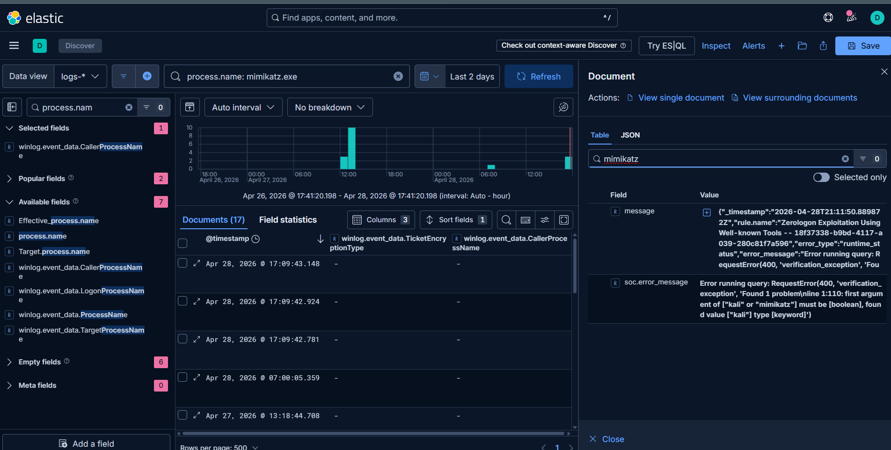

# Golden Ticket Attack - Incident Response & Purple Team Engagement Report
Classification: TLP:WHITE - Authorized Lab Environment
Engagement Type: Purple Team / Adversary Simulation
Analyst: David Mokom
Environment: Isolated Active Directory Lab (Windows Server 2022 DC + Windows 10 Workstation)
SIEM Stack: Elastic Stack (Elasticsearch + Kibana + Winlogbeat + Sysmon)

## Engagement Overview
A Golden Ticket attack abuses the Kerberos authentication protocol by forging a Ticket Granting Ticket (TGT) signed with the KRBTGT account's NTLM hash. This forged ticket grants unrestricted access to any Kerberos-enabled resource in the domain. Detection is non-trivial because the KDC is never contacted during ticket use. This report documents the adversary emulation and detection engineering lifecycle from memory acquisition to SIEM alert validation.

## Phase 1 - Memory Forensics on Domain Controller (FTK Imager)
Objective: Acquire a forensically sound physical memory image of the Domain Controller prior to credential extraction, establishing ground truth for artifact analysis.
FTK Imager was executed locally on the WIN-HS48GJMNOGP Domain Controller with administrative privileges to capture a raw memory dump. The acquisition was performed using the Physical Memory workflow, targeting the full RAM address space to ensure all resident artifacts were preserved before offensive tooling was introduced.

## Phase 2 - Credential Material Extraction (Mimikatz)
Objective: Extract the KRBTGT account NTLM hash and domain SID from LSASS memory, which are the two prerequisite artifacts for Kerberos ticket forgery.
Prior to execution, local defenses were neutralized to allow the payload to run. Mimikatz was executed on the DC under an administrative context. SeDebugPrivilege was explicitly asserted before targeting LSASS to ensure memory read access.

Command executed: privilege::debug
Command executed: lsadump::lsa /patch

Domain: CS
Domain SID: S-1-5-21-426635828-459186537-2548376310
KRBTGT NT Hash: 4c89c456b825f173d94aefc94d8718bd

The /patch flag was utilized to safely extract the required cryptographic material directly from the Local Security Authority Subsystem Service.

## Phase 3 - Kerberos Ticket Forgery & Pass-the-Ticket
Objective: Forge a syntactically and cryptographically valid TGT and inject it into the current logon session's Kerberos cache.
The ticket was constructed using the kerberos::golden module with the extracted environmental variables.

Command: kerberos::golden /user:Administrator /domain:cs.local /sid:S-1-5-21-426635828-459186537-2548376310 /krbtgt:4c89c456b825f173d94aefc94d8718bd /ptt

The /ptt flag successfully injected the forged TGT directly into memory, bypassing disk writes entirely and staging the session for lateral movement.

## Phase 4 - Access Validation via SMB
Objective: Confirm that the forged ticket grants authenticated access to the DC's administrative share (C$) using the injected ticket.
Command: dir \\WIN-HS48GJMNOGP\c$
Full administrative access was confirmed on WIN-HS48GJMNOGP. This validates the core premise of the Golden Ticket: the service trusts the PAC data embedded in the forged ticket without needing to query the KDC.

## Phase 5 - SIEM Detection Engineering in Elastic
Objective: Validate telemetry in Elasticsearch to detect the execution of the attack chain.
The investigation pivoted to hunting for process-level memory access. Searching the Elastic SIEM for mimikatz execution generated 531 raw hits. By refining the KQL query to specifically track mimikatz.exe interacting with lsass.exe, the exact credential dumping phase was successfully isolated, proving the detection pipeline's effectiveness against LSASS tampering.

## IOCs & Forensic Artifacts
Target Domain: cs.local
Target DC: WIN-HS48GJMNOGP
Forged Username: Administrator
Domain SID: S-1-5-21-426635828-459186537-2548376310
KRBTGT Hash: 4c89c456b825f173d94aefc94d8718bd

## Mitigations & Hardening Recommendations
1. Rotate KRBTGT password twice: A single rotation leaves the previous hash valid. Two sequential rotations with a replication delay invalidates all forged tickets.
2. Deploy Credential Guard: Isolates LSASS into a Virtual Trust Level protected process, preventing direct memory reads by Mimikatz.
3. Enable LSASS RunAsPPL: Configure the registry to require a signed driver for LSASS process handle acquisition.

---
