# Golden Ticket Attack Chain: Incident Response and Forensic Evidence Lab

This project was completed in an isolated Active Directory lab built for security learning and detection practice.

---

## Project Overview

This project simulates a Golden Ticket attack inside an isolated Active Directory lab and focuses on how the activity can be investigated from a defender’s point of view.

The goal was not just to run attack tools. The goal was to understand what evidence is created during a serious Active Directory compromise, how that evidence appears in Windows logs and Elastic, and how a security analyst could explain the attack path, validation steps, and remediation actions without overclaiming.

The lab includes memory capture with FTK Imager, Mimikatz execution, KRBTGT hash extraction, Golden Ticket creation and injection, Kerberos ticket validation, administrative share access validation, Elastic/Windows log review, KRBTGT remediation evidence, file activity telemetry review, Edge browser artifact review, and basic memory triage with Volatility 3.

---

## Why I Built This Project

Golden Ticket attacks matter because they abuse the trust model behind Kerberos authentication. If the KRBTGT account hash is compromised, an attacker can create forged Kerberos tickets that may be trusted by the domain.

I built this lab to practice three skills:

1. Understanding how Golden Ticket abuse works at a practical level.
2. Reviewing the evidence created by credential access, forged ticket use, administrative share access, and remediation activity.
3. Explaining the investigation clearly from a defender’s point of view.

This project helped me connect attacker behavior to defender visibility. It also showed me why credential theft, Kerberos abuse, and KRBTGT remediation need careful handling in an Active Directory environment.

---

## Lab Environment & Architecture

## Architecture

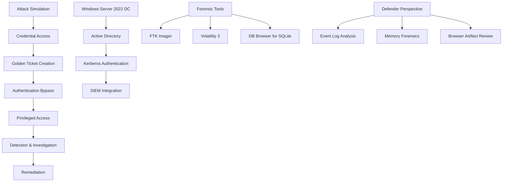
```mermaid
graph TD
    A[Attack Simulation] --> B[Credential Access]
    B --> C[Golden Ticket Creation]
    C --> D[Authentication Bypass]
    D --> E[Privileged Access]
    E --> F[Detection & Investigation]
    F --> G[Remediation]
    
    H[Windows Server 2022 DC] --> I[Active Directory]
    I --> J[Kerberos Authentication]
    J --> K[SIEM Integration]
    
    L[Forensic Tools] --> M[FTK Imager]
    L --> N[Volatility 3]
    L --> O[DB Browser for SQLite]
    
    P[Defender Perspective] --> Q[Event Log Analysis]
    P --> R[Memory Forensics]
    P --> S[Browser Artifact Review]
```

*Note: This diagram represents the lab environment and investigation workflow.*

| Component | Details |
|---|---|
| Domain Controller OS | Windows Server 2022 |
| Target Host | WIN-HS48GJMN0GP |
| Domain | cs.local |
| Domain SID | S-1-5-21-426635828-459186537-2548376310 |
| KRBTGT NTLM Hash Used in Lab | 4c89c456b825f173d94aefc94d8718bd |
| SIEM / Logging | Elastic and Windows Security logs |
| Forensics Tools | FTK Imager, Volatility 3, DB Browser for SQLite |
| Browser Artifact Reviewed | Microsoft Edge History SQLite database |

---

## Tools & Technologies Used

| Tool | Purpose |
|---|---|
| FTK Imager | Captured system memory for forensic review |
| Mimikatz | Performed KRBTGT hash extraction and Kerberos ticket testing in the lab |
| Windows Defender / Windows Security | Used to show endpoint protection state during controlled lab execution |
| Active Directory / Kerberos | Provided the authentication environment for the Golden Ticket simulation |
| Elastic / Kibana | Reviewed security events and supporting evidence |
| Windows Security Event Logs | Reviewed password reset and account modification events |
| Volatility 3 | Performed basic memory process review with `windows.pslist` |
| DB Browser for SQLite | Reviewed Microsoft Edge browser history artifacts |

---

## Attack and Investigation Flow

The project was organized around three main parts:

1. **Attack simulation**
   - Captured memory from the Windows Server system.
   - Disabled Defender in the lab so Mimikatz could run.
   - Extracted the KRBTGT hash.
   - Created and injected a forged Kerberos ticket.
   - Validated the ticket with `klist`.
   - Tested access to the Domain Controller administrative share.

2. **Detection and remediation review**
   - Reviewed Elastic and Windows log evidence after the activity.
   - Reset the KRBTGT password in Active Directory.
   - Reviewed Event ID 4724 and Event ID 4738 evidence related to the remediation.

3. **Supporting forensic artifact review**
   - Reviewed high-volume file activity telemetry in Elastic.
   - Located and opened the Microsoft Edge History database.
   - Used Volatility 3 to review process activity from a memory image.

This structure keeps the project focused on what matters most for a security analyst: what happened, what evidence was created, how it was validated, and what should be reviewed afterward.

---

## MITRE ATT&CK Mapping

| Technique | ID | Why It Applies |
|---|---|---|
| OS Credential Dumping | T1003 | Mimikatz was used to access credential material in the lab. |
| OS Credential Dumping: LSASS Memory | T1003.001 | Credential dumping activity involved LSASS-related access. |
| Steal or Forge Kerberos Tickets: Golden Ticket | T1558.001 | A forged Kerberos ticket was created using the KRBTGT hash. |
| Use Alternate Authentication Material | T1550.003 | The forged ticket was used for authentication instead of a normal password login. |
| Impair Defenses: Disable or Modify Tools | T1562.001 | Defender real-time protection was disabled for controlled lab execution. |
| Browser Information Discovery | T1217 | Browser history artifacts were reviewed as supporting forensic evidence. |
| Impact-Style File Activity | N/A | High-volume file creation/deletion activity was reviewed as ransomware-style telemetry, but file volume alone does not prove a specific MITRE impact technique. |

---

# Evidence Walkthrough

## Phase 1: Memory Capture and Baseline Evidence

I started by capturing memory with FTK Imager. The purpose was to practice evidence collection and create a memory image that could be reviewed later with forensic tooling.

This step matters because memory can contain active processes, loaded modules, credentials, and other volatile artifacts that may not exist on disk after a system is powered off.

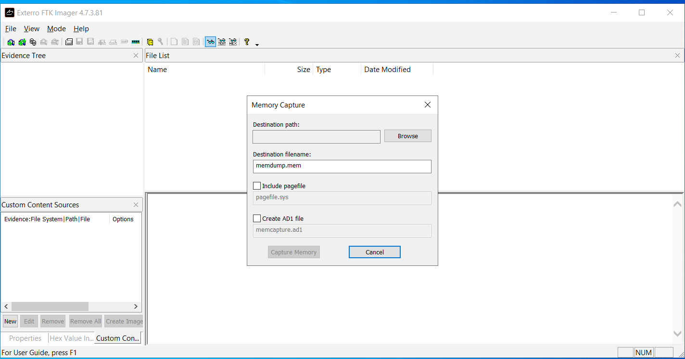

The memory capture completed successfully and produced an output file for later analysis.

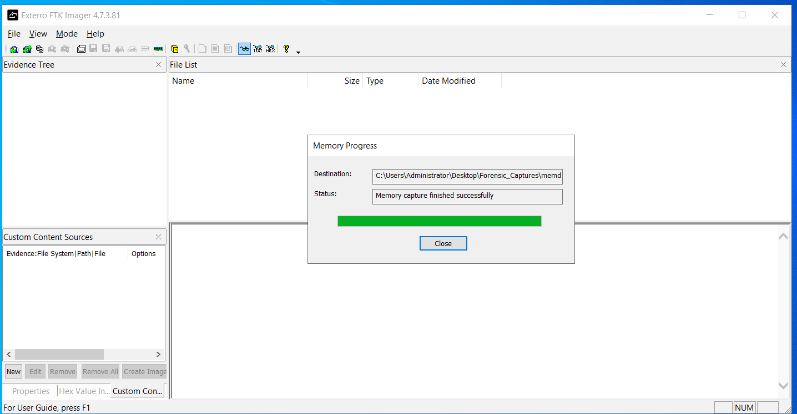

## What this proved

This confirmed that I could collect a memory image from the Windows Server system and preserve it for later forensic review.

The build notes for this project document baseline memory collection and later memory review. The important point is not to overstate this as full memory forensics. In this project, memory capture supported basic triage and process review.

---

## Phase 2: Defender Disabled for Controlled Lab Execution

Windows Defender real-time protection was disabled so Mimikatz could run in the controlled lab environment.

This was done for lab execution only. In a real environment, disabling endpoint protection would be suspicious behavior by itself and should be investigated immediately.

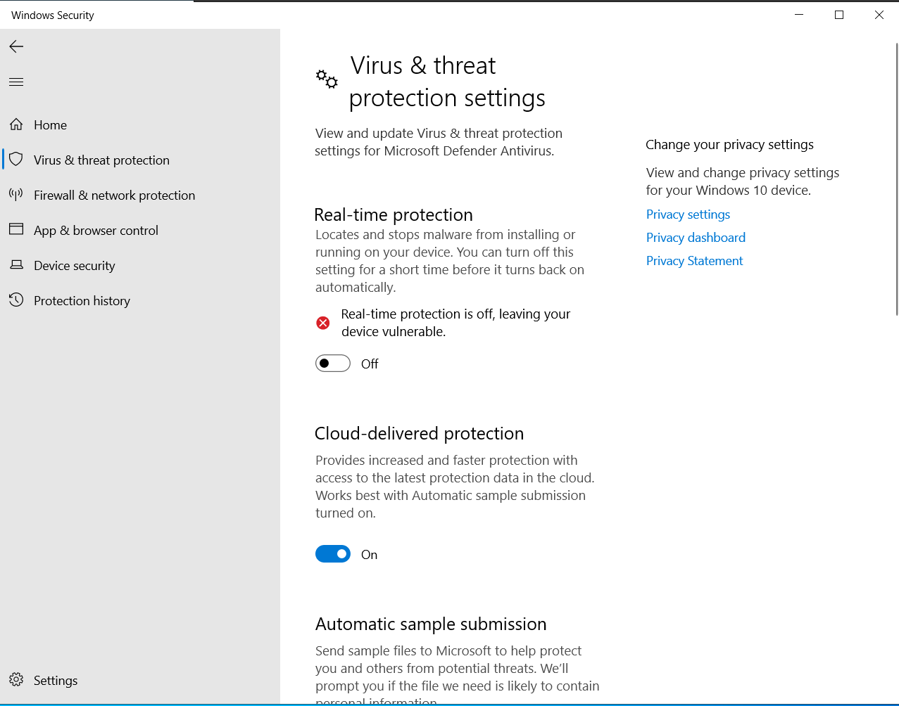

## What this proved

This showed the endpoint protection state before running credential access tooling. It also helped separate a lab requirement from real-world security expectations.

---

## Phase 3: Mimikatz Preparation and Execution

Mimikatz was extracted on the target system so the credential access portion of the lab could be performed.

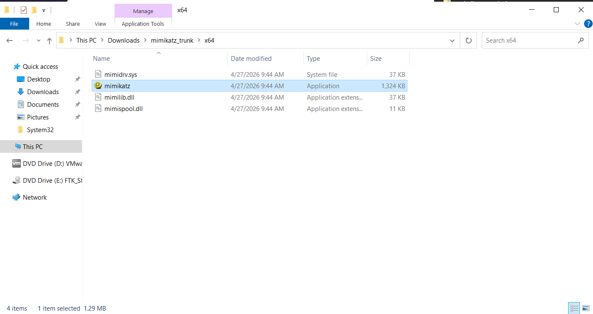

Mimikatz was then launched from an elevated session.

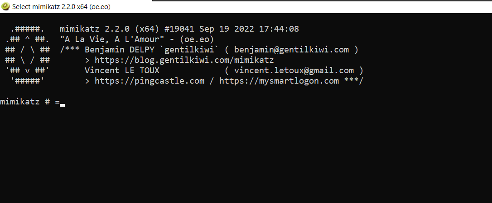

The `privilege::debug` command was executed inside Mimikatz. The successful response confirmed that the process had the required debug privilege to access sensitive process memory.

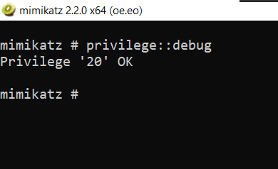

## What this proved

This confirmed that the lab system allowed Mimikatz to run with elevated privileges.

From a defender perspective, this is where I would care about suspicious process execution, LSASS access, endpoint telemetry, and any alert showing known credential dumping behavior.

---

## Phase 4: KRBTGT Hash Extraction

The KRBTGT account hash was extracted using Mimikatz.

The KRBTGT account is important because it signs Kerberos Ticket Granting Tickets. If this hash is compromised, an attacker can create forged Kerberos tickets that may be accepted by the domain.

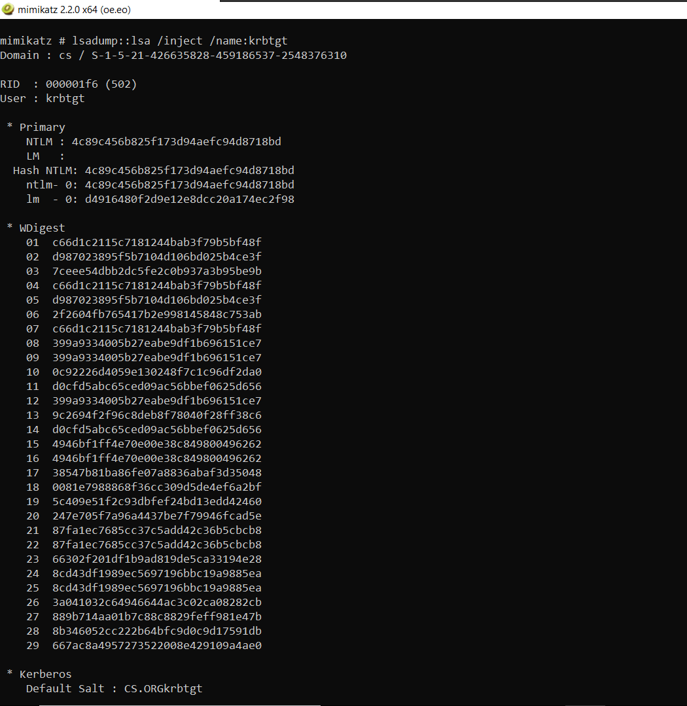

## What this proved

This confirmed that the KRBTGT hash was available in the lab and could be used for the Golden Ticket simulation.

The important defender takeaway is simple: KRBTGT compromise is serious because it affects the trust foundation of Kerberos authentication.

---

## Phase 5: Golden Ticket Creation and Injection

A forged Kerberos Ticket Granting Ticket was created using the KRBTGT hash, the domain SID, and the target domain information.

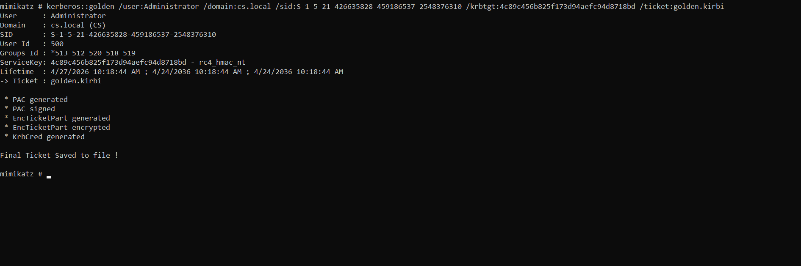

The forged ticket was then injected into the current session.

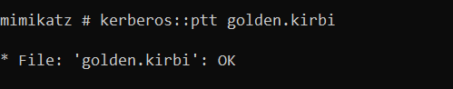

After injection, `klist` was used to confirm that the Kerberos ticket was loaded in the current session. The ticket showed the `Administrator` client in the `cs.local` domain and a long validity window, which matched the lab configuration.

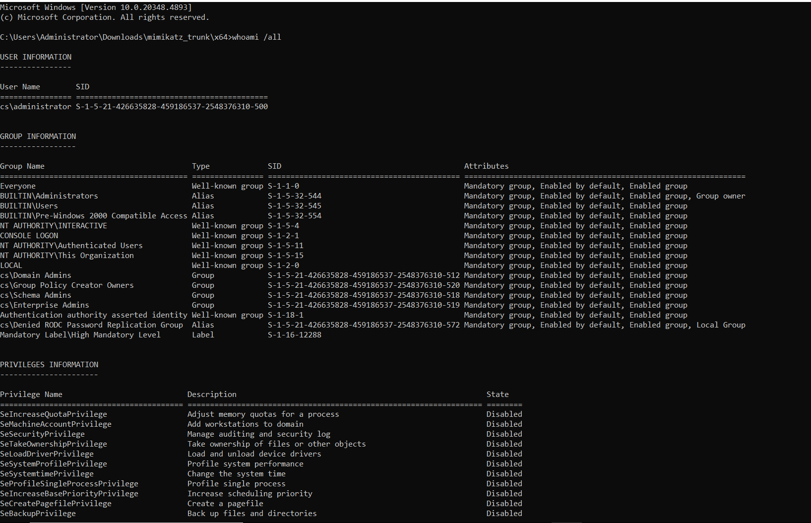

## What this proved

This confirmed that the forged ticket was created and loaded into the current session.

I kept the original screenshot filename for path compatibility, but the professional explanation should be “Kerberos ticket validation,” not “God Mode.” The important point is that the forged ticket was present and could be tested against domain resources.

---

## Phase 6: Access Validation

After the ticket was injected, I validated the session context and group membership.

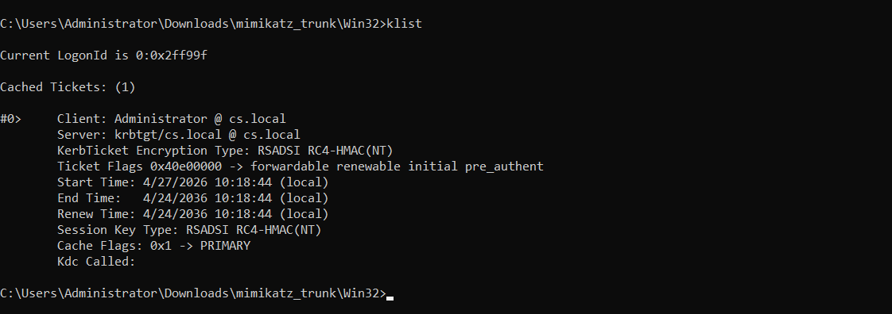

I then tested access to the Domain Controller administrative share.

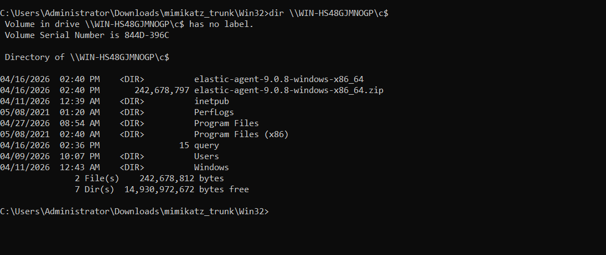

## What this proved

This confirmed that the forged ticket was usable in the lab and allowed access to the administrative share on the Domain Controller.

From an incident response point of view, this is the impact: a forged Kerberos ticket can allow privileged access without needing the current password for the account being impersonated.

---

## Phase 7: Detection Review in Elastic / Windows Logs

After the attack simulation, I reviewed Elastic and Windows log evidence to determine what activity was visible.

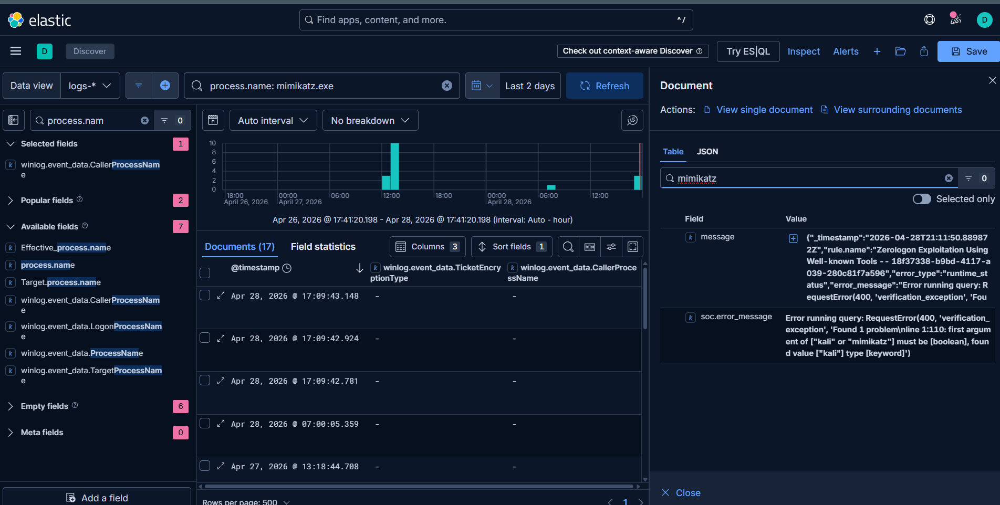

## What this proved

This screenshot supports the Elastic review portion of the lab, but I am careful not to overstate it as perfect detection coverage.

The evidence showed that Mimikatz-related activity could be searched and reviewed in Elastic. The important lesson was learning where an analyst would pivot next, not claiming that one screenshot proves the entire attack chain was automatically detected.

## Analyst reasoning

For this type of activity, I would look for evidence such as:

- Suspicious process execution
- LSASS access or credential dumping behavior
- Mimikatz-related detections or process artifacts
- Directory service access related to credential extraction
- Kerberos ticket behavior
- SMB administrative share access
- Privileged account use
- KRBTGT account changes during remediation

---

## Phase 8: KRBTGT Remediation Review

After validating the Golden Ticket behavior, I performed KRBTGT password reset remediation in the lab.

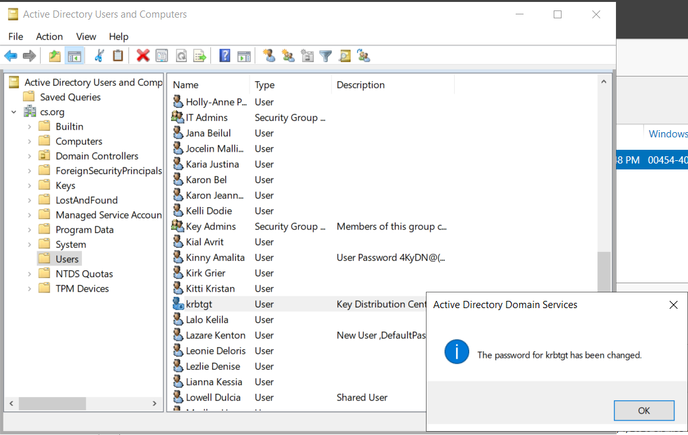

I then reviewed log evidence showing the password reset activity.

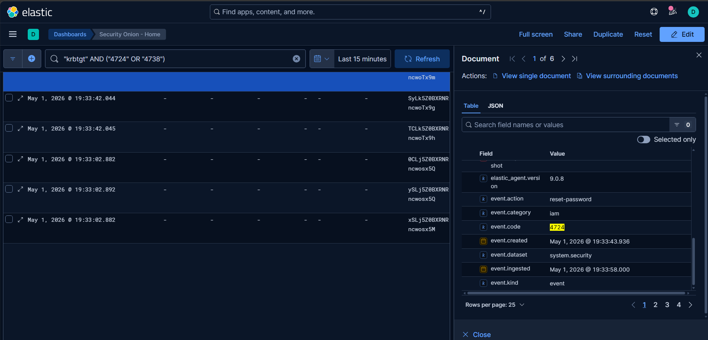

Windows Security Event ID 4738 showed that the KRBTGT account was modified.

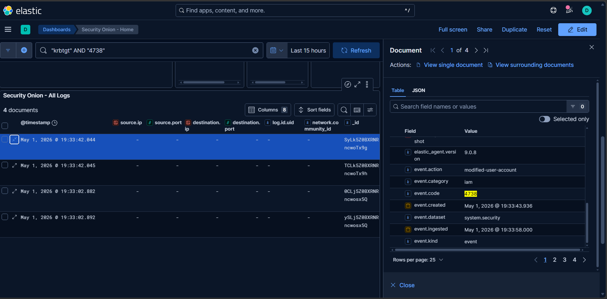

## What this proved

This confirmed that KRBTGT remediation activity produced Windows log evidence.

The screenshots show Event ID 4724 for password reset activity and Event ID 4738 for account modification activity. In a real environment, KRBTGT remediation must be handled carefully because Active Directory keeps current and previous KRBTGT password material for Kerberos validation.

## What I would monitor

During and after KRBTGT remediation, I would monitor:

- KRBTGT account modification events
- Password reset events
- Kerberos ticket behavior
- Authentication failures after reset
- Privileged account activity
- Domain Controller replication health

---

## Phase 9: File Activity Telemetry Review

I also reviewed a high-volume file activity spike in Elastic using the `RansomwareTest` path.

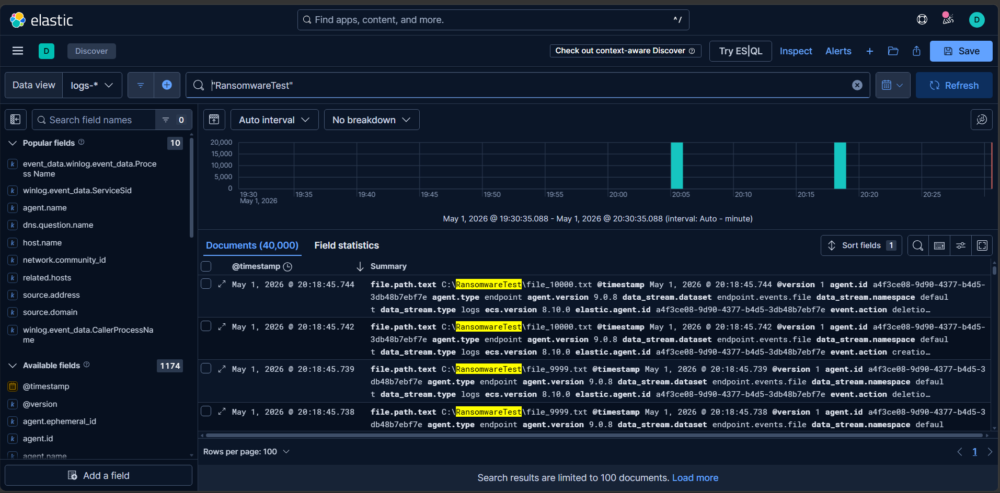

## What this proved

This showed how large volumes of file creation and deletion activity can appear in Elastic.

I treated this as supporting ransomware-style impact telemetry rather than the core Golden Ticket evidence. The main value was seeing how file activity spikes can help an analyst recognize suspicious behavior that may need additional investigation.

## Important limitation

High file activity alone does not prove ransomware, and it does not automatically prove a specific MITRE impact technique. It needs supporting context such as:

- The process responsible for the file activity
- File paths affected
- File extensions
- User account context
- Timeline correlation
- Whether files were encrypted, deleted, renamed, or modified
- Whether backups or recovery mechanisms were affected

---

## Phase 10: Browser Forensics Review

I reviewed Microsoft Edge browser history as a supporting forensic artifact.

The Edge history database was located in the Administrator profile.

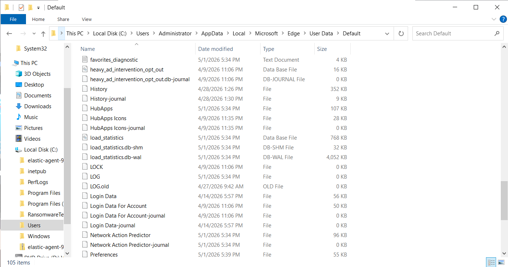

The database was opened in DB Browser for SQLite and reviewed for URL and visit activity.

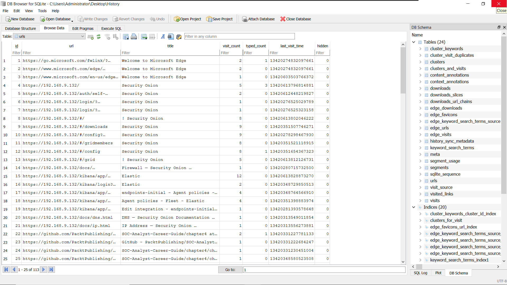

## What this proved

This showed that browser history can support timeline reconstruction during an investigation.

In this project, browser history was treated as a supporting forensic exercise. It was not the primary evidence source for the Golden Ticket activity, but it helped me practice locating and reviewing user activity artifacts.

---

## Phase 11: Volatility Memory Review

Volatility 3 was used to inspect a captured memory image.

The `windows.pslist` plugin was used to list running processes from the memory image.

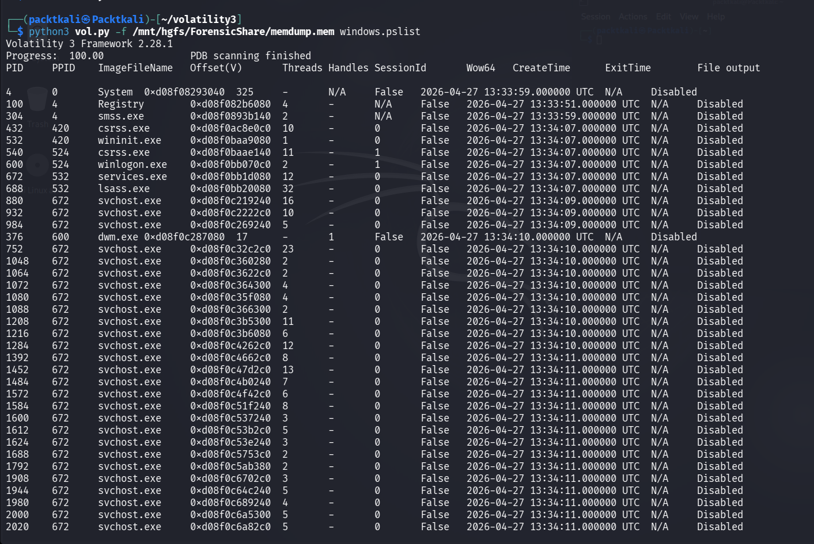

## What this proved

This confirmed that I could use Volatility 3 to parse a Windows memory image and review process activity.

The screenshot shows basic process-list output, including normal Windows processes such as `lsass.exe`, `winlogon.exe`, `services.exe`, and multiple `svchost.exe` entries. This was useful for practicing memory triage, but it should not be described as full malware analysis or deep memory forensics.

Process listing is only a starting point. Deeper analysis would require additional plugins and correlation with event logs, command-line data, network connections, handles, DLLs, and suspicious parent-child relationships.

---

# Key Findings & Analysis

## 1. KRBTGT compromise is high-impact

The KRBTGT hash allowed a forged Kerberos ticket to be created and tested against domain resources in the lab. This showed why KRBTGT protection and careful remediation are important in Active Directory environments.

## 2. Credential dumping should be investigated early

By the time a Golden Ticket is created, the environment may already be deeply compromised. Earlier detection around suspicious process execution, LSASS access, privileged account activity, and directory service access is critical.

## 3. Remediation creates evidence too

KRBTGT reset activity generated Windows log evidence. Remediation actions should be documented and monitored just like attack activity.

## 4. Elastic evidence needs careful interpretation

Finding related events in Elastic is useful, but one screenshot does not prove full attack-chain detection. The stronger skill is knowing what to search for, what fields matter, and where to pivot next.

## 5. Forensic artifacts need context

Memory, browser history, and file activity telemetry can support an investigation, but none of them should be treated as complete evidence by themselves. They need timeline correlation and supporting logs.

---

# IOCs and Evidence Artifacts

| Artifact | Value |
|---|---|
| Domain | cs.local |
| Target Hostname | WIN-HS48GJMN0GP |
| Domain SID | S-1-5-21-426635828-459186537-2548376310 |
| KRBTGT NTLM Hash Used in Lab | 4c89c456b825f173d94aefc94d8718bd |
| Volume Serial Number | 844D-396C |
| Forged Ticket Lifetime | 10 years in lab |
| Key Windows Events Reviewed | 4724, 4738 |
| Browser Artifact Path | `%LOCALAPPDATA%\Microsoft\Edge\User Data\Default\History` |
| Volatility Plugin Used | `windows.pslist` |
| Main MITRE Techniques | T1003, T1003.001, T1558.001, T1550.003, T1562.001, T1217 |

---

# Mitigation and Hardening Notes

| Recommendation | Why It Matters |
|---|---|
| Protect the KRBTGT account | KRBTGT compromise can allow forged Kerberos ticket creation. |
| Use a careful KRBTGT reset process | KRBTGT remediation should be staged and planned to avoid authentication disruption. |
| Monitor privileged account activity | Golden Ticket abuse often involves privileged access or unusual administrative behavior. |
| Monitor LSASS access | Credential dumping often requires access to LSASS memory. |
| Enable Credential Guard where possible | Helps protect credential material from direct memory access. |
| Use EDR or endpoint telemetry | Improves visibility into tools like Mimikatz and suspicious process behavior. |
| Monitor Kerberos anomalies | Unusual ticket lifetimes, encryption types, or service ticket behavior can support investigation. |
| Alert on KRBTGT account changes | KRBTGT changes are rare and should be reviewed immediately. |
| Limit Domain Admin exposure | Privileged credentials should not be used casually across workstations or servers. |
| Use Privileged Access Workstations | Helps reduce the chance of privileged credential theft. |

---

# Limitations

This was a controlled home lab, not a production enterprise environment.

Important limitations:

- The activity was simulated in a small Active Directory environment.
- Defender was disabled to allow the lab to run, which changes the detection environment.
- The Elastic screenshot supports investigation and search activity, but it should not be treated as proof of complete detection coverage.
- The file activity telemetry was treated as supporting ransomware-style behavior, not proof of a specific ransomware family or full impact technique.
- Browser history analysis was included as supporting forensic practice, not as the main proof of compromise.
- Volatility analysis focused on basic process listing, not full memory malware analysis.
- The detections reviewed were based on available lab telemetry and should not be treated as production-ready coverage.

In a real environment, I would want stronger correlation across endpoint logs, Sysmon, EDR, Kerberos events, network telemetry, authentication logs, and Domain Controller replication data.

---

## What was the main goal?

The main goal was to understand Golden Ticket abuse from both sides: how the attack works and how a defender can investigate the evidence afterward.

## Why is KRBTGT important?

KRBTGT signs Kerberos Ticket Granting Tickets. If the KRBTGT hash is stolen, an attacker can forge tickets that may be trusted by the domain.

## What did Mimikatz do in this lab?

Mimikatz was used to enable debug privileges, extract the KRBTGT hash, create a forged Kerberos ticket, and inject that ticket into the current session.

## What did `klist` prove?

`klist` showed that the forged Kerberos ticket was loaded into the current session and had the expected lab-configured validity period.

## What did the access validation prove?

The access validation showed that the forged ticket could be used to access the Domain Controller administrative share in the lab.

## Why does KRBTGT need to be reset carefully?

Active Directory keeps current and previous KRBTGT password material for Kerberos validation. A careless reset can cause authentication issues, so remediation should be staged and validated.

## Was the file activity telemetry the main part of the project?

No. It was supporting telemetry review. The core project was the Golden Ticket attack and investigation flow.

## Was browser history the main evidence?

No. Browser history was included as a supporting forensic artifact to practice timeline reconstruction.

## Was Volatility used for deep malware analysis?

No. In this version, Volatility was used for basic memory triage through process listing. Deeper memory analysis would require more plugins and timeline correlation.

---

# Screenshot Evidence

| Screenshot | What It Shows |
|---|---|
| `screenshots/01_FTK_Baseline_Memory_Capture.png` | FTK memory capture setup |
| `screenshots/02_FTK_Memory_Capture_Success.png` | Memory capture completed |
| `screenshots/03_Windows_Defender_Disabled.png` | Defender disabled for lab execution |
| `screenshots/04_Mimikatz_Files_Extracted.png` | Mimikatz files extracted |
| `screenshots/05_Mimikatz_Initialization.png` | Mimikatz launched |
| `screenshots/06_Mimikatz_Debug_Privilege_Enabled.png` | Debug privilege enabled |
| `screenshots/07_KRBTGT_Hash_Dumped.png` | KRBTGT hash extraction and domain SID evidence |
| `screenshots/08_Golden_Ticket_Forged.png` | Golden Ticket created and saved as `golden.kirbi` |
| `screenshots/09_Golden_Ticket_Injected.png` | Ticket injected with `kerberos::ptt` |
| `screenshots/10_God_Mode_Verification.png` | Kerberos ticket validation with `klist` |
| `screenshots/11_Golden_Ticket_Injection_Verification.png` | Session/group validation after ticket injection |
| `screenshots/12_Post_Exploitation_Access_Validation.png` | Administrative share access validation |
| `screenshots/13_SIEM_Alert_Mimikatz_Detection.png` | Elastic review of Mimikatz-related evidence |
| `screenshots/14_KRBTGT_Password_Reset_Remediation.png` | KRBTGT password reset in Active Directory |
| `screenshots/15_KRBTGT_Remediation_Log_Validation.png` | Event ID 4724 password reset evidence |
| `screenshots/16_KRBTGT_Account_Modified_Event_4738.png` | Event ID 4738 account modification evidence |
| `screenshots/17_Ransomware_Telemetry_Spike_T1490.png` | High-volume file activity telemetry in Elastic |
| `screenshots/18_Edge_History_Database_Extraction.png` | Edge History database location |
| `screenshots/19_Edge_History_Artifact_Analysis.png` | Edge History database reviewed in DB Browser for SQLite |
| `screenshots/20_Volatility_Process_List_Analysis.png` | Volatility `windows.pslist` process output |

---

## Repository Information

**Project**: Golden-Ticket-Attack-Chain-IR
**Author**: Dmokom1  
**Purpose**: Hands-on cybersecurity lab for skill development
**Environment**: Isolated home lab with Windows Server 2022 DC
**Tools**: See "Tools Used" section above

### Usage Notes:
- This repository documents a learning exercise, not production code
- All screenshots are from controlled lab environments
- Techniques demonstrated are for educational purposes only
- Always follow organizational policies and legal guidelines

### Contributing:
While this is primarily a personal learning portfolio, suggestions and feedback are welcome. Please open an issue to discuss improvements.

### License:
MIT License - see [LICENSE](LICENSE) file for details.
