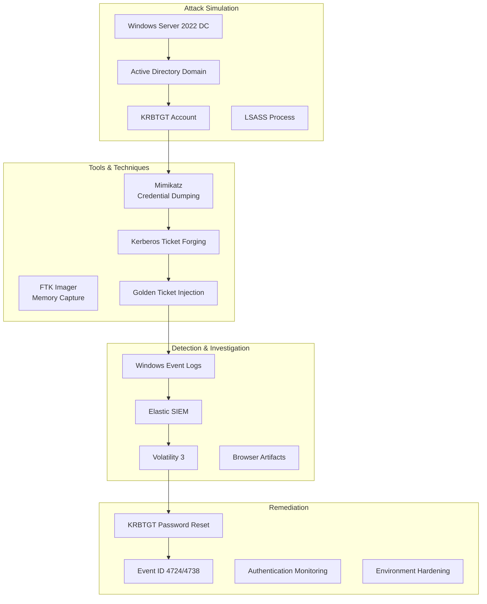

# Golden Ticket Attack Lab Architecture

## Component Details

### 1. Active Directory Environment
- **Domain Controller**: Windows Server 2022
- **Domain**: cs.local  
- **KRBTGT Account**: Special AD account that signs Kerberos TGTs
- **Test System**: WIN-HS48GJMN0GP

### 2. Attack Tools
- **FTK Imager**: Memory capture for forensic analysis
- **Mimikatz**: Credential dumping and ticket manipulation
- **Kerberos Utilities**: klist for ticket validation

### 3. Detection Stack
- **Windows Event Logs**: Security events (4724, 4738, etc.)
- **Elastic SIEM**: Centralized log analysis
- **Volatility 3**: Memory forensic analysis
- **SQLite Browser**: Browser artifact examination

### 4. Investigation Workflow
1. Memory capture and baseline evidence collection
2. Defender configuration review
3. Credential dumping simulation
4. Golden Ticket creation and validation
5. Detection evidence review in SIEM
6. Remediation activity and log validation
7. Supporting forensic artifact analysis
